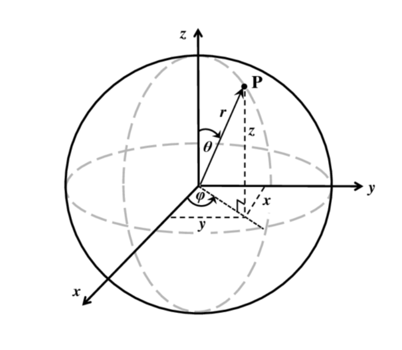

# Introduction to Quantum Mechanics

## The $\textbf{Schr\"odinger}$ Equation For The Hydrogen-like Systems

Start form the $\text{Schr\"odinger}$ equation, the $\hat{H}\Psi = \hat{E}+\hat{V} = (-\frac{\bar{h^2}}{2m}\grad^2 + V)\Psi$

The potential $V$ experienced by two charges separated by some distance $r$ is best described by a Coulomb term
$$
V(r) = \frac{Ze^2}{4\pi \epsilon_0 r}
$$

- where $Ze$ is the charge of the nucleus, (Z = 1 being the hydrogen case, Z = 2 helium, etc.)
- $\epsilon_0$ is the permittivity of vacuum

### Separating The Radial From The Angular Part

The $\text{Schr\"odinger}$ equation in Cartesian coordinates is:
$$
\hat{H}\Psi=[-\frac{h^2}{2m}(\frac{\partial^2}{\partial^2 x}+\frac{\partial^2}{\partial^2y}+\frac{\partial^2}{\partial^2z})-\frac{Ze^2}{4\pi\epsilon_0r}]\Psi
$$
The potential part has spherical symmetry. One could write r = x2 + y2 + z2 and solve Eq. 2 in

Cartesian coordinates. This would work but it would be very tedious, as the mathematics does not display

the symmetry of the physics. Accordingly, we rather exploit the spherical symmetry of the electrostatic potential and perform a coordinate transformation from Cartesian Coordinates (efficient for rectangle shapes) to Spherical Polar Coordinates (efficient for spherical shapes).

$$
(x,y,z) = (r, \theta, \phi)\\
x = r\sin\theta\cos\phi\\
y = r\sin\theta\sin\phi\\
z = r\cos\theta
$$

$$
\hat{H}\Psi =[-\frac{\bar{h}^2}{2m}(\frac{\partial^2}{\partial^2 r})]
$$

