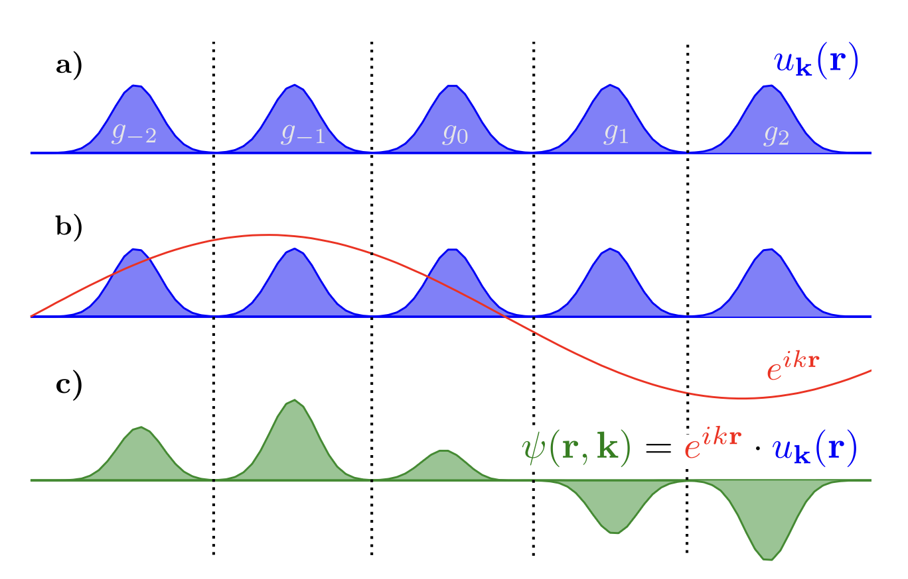

# DFT in solids

## Recap of DFT

**1. Kohn-sham equation (Auxiliary method)**
$$
(-\frac{1}{2}\nabla + \underset{V_{eff}(\vec{r_1})}{\underbrace{{V_{ne} +V_H+V_{xc}}}})\, \theta_i (\vec{r_1}) = \epsilon_i \theta_i(\vec{r_i})
$$
**2. SCF Loop**

**3. $\mathbf{E_{xc}[\rho]}$**

- **LDA:** uniform electron gas $E_{xc}^{LDA}-\int\rho(\vec{r})\epsilon_{xc}[\rho(\vec{r})]d\vec{r}$

$\epsilon_{xc} = \underset{\text{exchange}}{\underbrace{\epsilon_x}} + \underset{\text{correlation}}{\underbrace{\epsilon_c}}$

e.g. VWN, PZ, PWQ, SPZ

Effective but over-binding

- **GGA:** add $\nabla \rho(\vec{r})$ (Non-homogeneity)

$E_\text{xc}^\text{GGA} = \int f(\rho,\nabla \rho)d\vec{r}= E_\text{x}^\text{GGA}(\rho) +E_\text{c}^\text{GGA}(\rho)$

e.g. PBE, BLYP, ...

Very good property results, mostly used for geometries, energies.

- **self interaction problem**

In HF, $E_x^{HF}+E_H = 0$ , when $i=j$ (Cancelled)

In DFT, not fully cancelled out.

- **Hybrid functional:**

Mix DFT with HF

e.g. B3LYP: adjustable parameters

​	PBEO: $25\% E_x^{HF} + 75\% E_x^{PBE} + E_c^{PBE}$

​	HSE06: adjustable parameters, solid

- **4. Jacob ladder:**

$\text{LDA}\rightarrow \text{GGA}\rightarrow \text{meta-GGA} \rightarrow \text{hybrid functional}\rightarrow \text{exact solution}$

## Periodic structures

> [!NOTE]
>
> **The Bravais Lattice:** The positions and types of atoms in the primitive cell form the basis. The set of translations, which generate the entire periodic crystal by repeating the basis, is a lattice of points in space called the Bravais Lattice.

$$
\text{Crystal structure} = \text{Bravais Lattice} + \text{basis}
$$

**Primitive Cell:**

- Smallest unit cell
- Fill whole space through translation
- It has a single lattice point

**Wigner-Seitz unit cell (unique primitive cell):**

**Translation:**
$$
T(\vec{n}) = n_1\vec{a_1}+ n_2\vec{a_2}+...+n_d\vec{a_d} =\sum_i^d n_i\vec{a_i}
$$
For FCC:

Primitive lattice vector:  $\vec{a_1} &= (0,\frac{1}{2},\frac{1}{2})\\ \vec{a_2}&=(\frac{1}{2},0,\frac{1}{2})\\\vec{a_3}&=(\frac{1}{2},\frac{1}{2},0)$ 			Conventional lattice vector: $\vec{a_1} &= (1,0,0)\\ \vec{a_2}&=(0,1,0)\\\vec{a_3}&=(0,0,1)$

**Volume:**

 $d=1,& |\vec{a_1}|\\d=2,& |\vec{a_1}\times \vec{a_2}|\\d=3,& |\vec{a_1}\times \vec{a_2}\times \vec{a_3}|$ or  $V = \det|a_{ij}|$

**Space group:**

Translation group + point group

Symmetry group: group of symmetry transformations, e.g. rotation, reflection, inversion

## The Reciprocal Lattice and Brillouin Zone

## The Bloch Theorem

Introduces the periodicity of the crystalline potential (of the unit cell) into the wave function:
$$
\Psi_i(\vec{r},\vec{k}) = e^{i\vec{k}\cdot\vec{r}}\,\mu_{\vec{k}}(\vec{r})
$$

- $k$ is the wave vector, $\vec{k} = k_1\vec{b_1}+k_2\vec{b_2}+k_3\vec{b_3}$

## Plane-wave basis set

For charge density:
$$
\rho_n(r) = \int\Psi_{nk}(r)^\star\Psi_{nk}(r)dr\\
\overset{\text{Bloch theorem}}{\Rightarrow}  = \int \left(e^{-i\mathbf{k}\cdot\mathbf{r}} u_{n\mathbf{k}}^\star(\mathbf{r})\right)
\left(e^{i\mathbf{k}\cdot\mathbf{r}} u_{n\mathbf{k}}(\mathbf{r})\right) d\mathbf{k} \\
= \int |u_{n\mathbf{k}}(\mathbf{r})|^2\, d\mathbf{k}
$$
So, how to represent $\Psi_{nk}(r)$, $\Rightarrow$ **plane wave basis set + pseudo-potential**

**Plane-wave:**
$$
\text{Expand:} \, \Psi_{nk}(r)=\frac{1}{\sqrt{\Omega_\text{cell}}}\sum_{\vec{G}}e^{i(k+G)r}\cdot C_{Gnk}\\
\sum_{\vec{G}}|C_{Gnk}|^2=1
$$

> [!NOTE]
>
> **PW vs LCAO:**
>
> PW: 
>
> 1. +: Orthonormal
> 2. +: Independent of atomic positions
> 3. +: No basis set superposition errors (BSSE)
> 4. -: Large basis set (expensive to compute)
> 5. -:  Hard to deal with localized orbitals
>
> LCAO:
>
> 1. +: Chemistry insight
> 2. +: Small basis set (cheaper to compute)
> 3. -: not orthogonal
> 4. -: depends on atomic positions
> 5. -: BSSE

**Plane-waves Cut-Off**

Due to the PW expansion remains exact in the limit of an infinite number of G-vectors and all the plane waves fulfill the condition of orthonormality. However, in real situations, we can only have limit plane waves. To determine that:
$$
\frac{1}{2}|\mathbf{k} + \mathbf{G}|^2 \le E_\text{cutoff}
$$

## DFT for Solids in the Plane-Wave Formalism

$$
E_{\mathrm{KS}}[\rho] 
= T_s[\rho] 
+ \int d\mathbf{r}\, V_{\mathrm{ne}}(\mathbf{r})\rho(\mathbf{r}) 
+ E_{\mathrm{Hartree}}[\rho] 
+ E_{nn} 
+ E_{\mathrm{xc}}[\rho]
$$

**In solids:**
$$
(-\frac{1}{2}\nabla_i^2 + V_\text{eff}(\vec{r_i}))\Psi_{n\vec{k}}(\vec{r}) = \epsilon_{n\vec{k}}\Psi_{n\vec{k}}(\vec{r})
$$
Solve KS equation for solids:

1. Choose $E_\text{cutoff}\quad \&\quad\text{k-points grid}$
2. Compute $\rho(r)=\frac{1}{\Omega_{Bz}}\sum_n \int_{BZ}f_{nk}|\Psi_{nk}(r)|^2dk$

## Pseudopotential

To deal with the external potential term $V_\text{ne}$ : Plane wave is expensive since we need large basis set, the reason is $V_\text{ne}(\vec{r_\text{ne}}) =-\frac{\mathcal{Z}_A}{|\vec{r_A}-\vec{r_i}|}$, when $\vec{r_{ne}}\rightarrow 0\Rightarrow \text{singularity of } V_{ne}$, so, $V_{ne}$ is very oscillate near core! It's very hard to fit and needs more PW.

**Examples:**

- Non-conserving PP (NCPP): integrated charge $r<r_c$, same as all electron case
- Ultrasoft PP (USPP): Relax norm-conservation then add augmentation charge to recover the correct charge density $\rho$
- Projector augmented wave PP (PAW-PP): Reconstruct all electron wave function from pseudopotential using projectors.