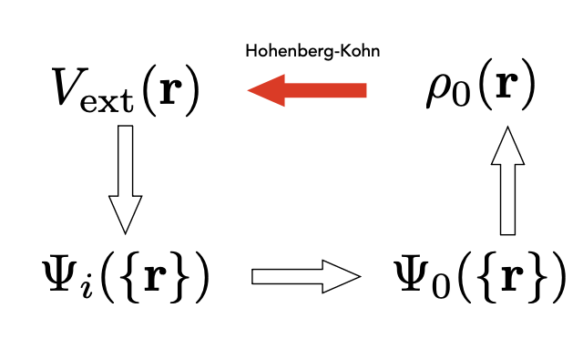

# DFT

**Electron density $\mathbf{\rho(r)}$**

For a multi-electron wave function $\Psi(x_1, x_2, \ldots, x_N) \rightarrow \underset{\underset{x,y,z}{\text{Spatial}}}{3N} + \underset{\text{Spin}}{N}$ variables $\rightarrow$ It is quire complex!

So, we use density to describe it:
$$
\rho(r)=N\int...\int|\Psi(x_1, x_2, \ldots, x_N)|^2dx_1dx_2,...,dx_N
$$
Properties:

1. $\rho(r\rightarrow\infty)=0$
2. $\int\rho(r)dr=\underset{\text{num of electrons}}{N}$

**Functional:** function of functions

|            | Input    | Output   | Example                                    |
| :--------: | -------- | -------- | ------------------------------------------ |
|  Function  | Number   | Number   | $f(x)=\sin(x)$                             |
| Functional | function | Number   | $F[\rho(r)]$, $\int_{-\pi}^{\pi}\sin(x)dx$ |
|  Operator  | function | function | $H\Psi= \hat{H}\Psi$                       |

------

## The Hohenberg-Kohn Theorems

> **Theorem I:** For any system of interacting particles in an external potential  \( V_{\mathrm{ex}}(\mathbf{r}) \), the potential \( V_{\mathrm{ex}}(\mathbf{r}) \)  is determined uniquely, except for a constant, by the ground-state particle density  \( \rho_0(\mathbf{r}) \).

$$
E_\text{total}=\int\Psi^\star(r_1,...,r_N)\hat{H}\Psi(r_1,...,r_N)\rightarrow \underset{\text{Dirac notation}}{<\Psi|\hat{H}|\Psi>}
$$

$$
\hat{H} =
\underset{\text{kinetic}}{\underbrace{-\frac{1}{2}\sum_{i=1}^N \nabla_i^2}}
+ 
\underset{\text{nucleus--electron potential}}{\underbrace{\sum_{i=1}^N V(r_i)}}
+ 
\underset{\text{electron--electron interaction}}{\underbrace{\frac{1}{2}\sum_{i \ne j} \frac{1}{|r_i - r_j|}}}
$$

$E_{\text{total}}$ is a function of $\Psi$, we indicate this property using square brackets:
$$
E_\text{Tot} = F [\Psi_i({r})]
$$

> **Theorem II:** A universal functional for the total energy $E[\rho]$ in terms of the density $\rho(r)$ can be defined, valid for an external potential $V_\text{ex}(r)$. For any particular $V_\text{ex}(r)$, the exact ground state energy of the system is the global minimum value of this functional, and the density ρ(r) that minimizes the functional is the exact ground state density $\rho_0(r)$.

------

## The Kohn-Sham Auxiliary System

Previous section describes how to represent multi-electron system into density form, using functional, but what functional looks like? How to solve it?

> [!NOTE]
>
> Same $\rho_0(r)$, but not approximation compared with Hartree-Fock method.

The actual density functional theory calculations are performed on the auxiliary single-electron independent-particle system defined by the mono-electronic auxiliary hamiltonian $\hat{H}_\text{aux}$, also known as the Kohn-Sham operator $\hat{F}_\text{KS}$ in $a.u.:^2$
$$
\hat{H}_\text{aux}=\hat{F}_\text{KS}=-\frac{1}{2}\nabla^2+V_\text{eff}(r)
$$

\[
\left\{
\begin{aligned}
&\text{eigenvalue}\rightarrow \theta_i(r) \quad\text{: K-S orbitals(one electron orbital)} \\
&\text{eigenvalue}\rightarrow \epsilon_i \quad\text{:eigenvalue for orbital i}
\end{aligned}
\right.
\]