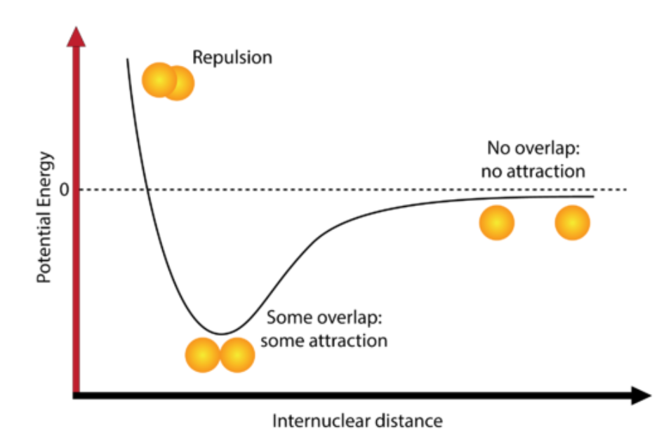
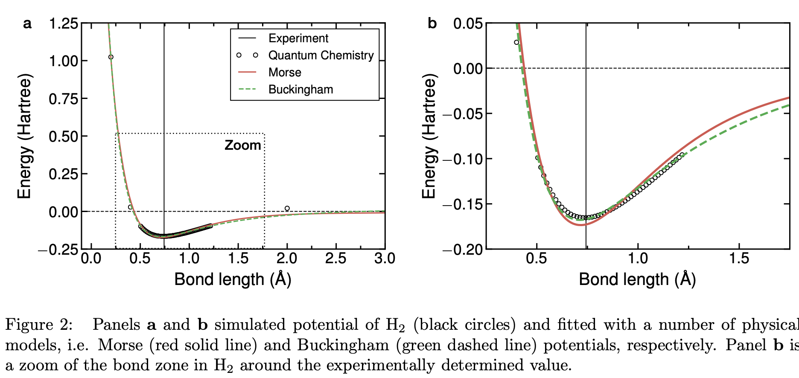
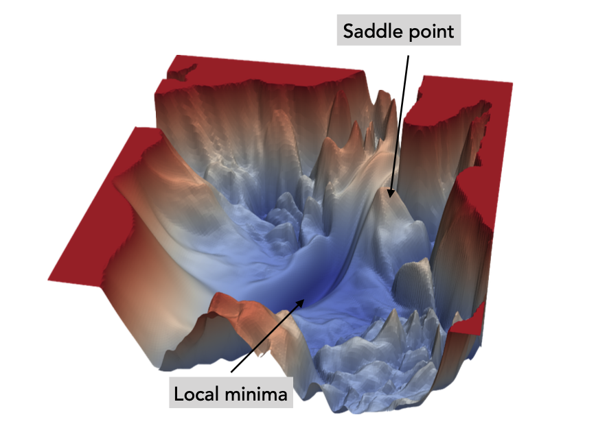
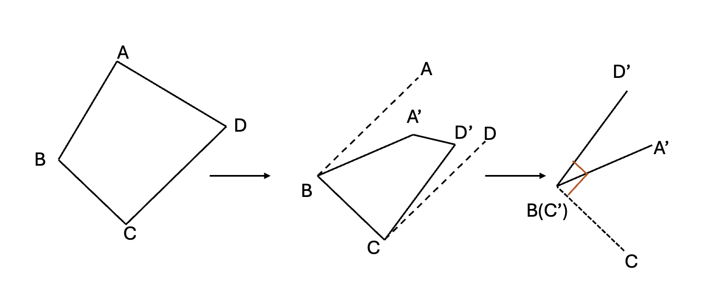
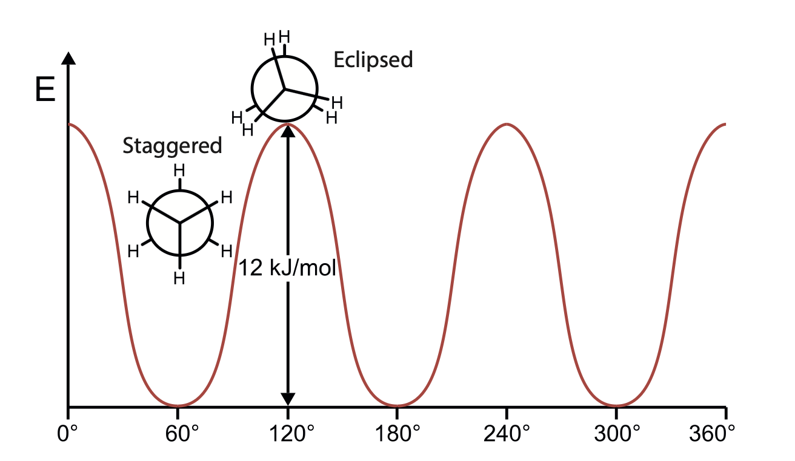

# Force Field 1

## 1. Conservation of Energy, Kinetic and Potential Energies

### Conservation of Energy

> [!NOTE]
>
> In an isolated system, i.e., a system that does not exchange energy and matter with its surroundings, the total energy of the system is conserved. The total quantity of energy of an isolated system does not change, though it may change form.

The total energy can be described same as classical physics:
$$
E = \underset{\text{Potential}}V +\underset{\text{Kinetic}}K
$$
The potential only depends on the relative position of selected coordinates. If a force $F$ acting on an object is a function of position only, it is said to be a conservative force which can be represented by:
$$
F(x)=-\frac{dV}{dx}
$$
So, the overall potential:
$$
V(x)=-\int_{x_0}^xV(x_0)+F(x)dx
$$

### Potential Energies of chemicals

**Diatomic bond**

H --- H

Assumption:

- Isolated system; 
- No energy exchange with environment

Figure 2 shows the simulated potential of $H_2$ through advanced quantum chemical methods, which are the

object of the following lectures. The black vertical line in Figure 2 shows the bond length of $H_2$ measured experimentally $∼0.743\text{\AA}$

These results can be fitted by analytical functions such as Morse and Buckingham potential that include both the repulsive terms at very small intermediate distances, as well as the attractive van der Waals forces at long interatomic distances.

**Morse potential**

The Morse potential has the peculiar feature that describes accurately that when the bond is stretched to very large distances, the potential energy E(r) should approach the value of dissociation energy of the molecule in its respective atoms.
$$
E_\text{Morse}(x-x_0)= D [(1-e^{-\alpha(x-x_0)})]^2\\
\alpha= \sqrt{\frac{k}{2D}}
$$

- $D$ is the dissociation energy of the bond 
- $\alpha$ is the force constant (the spring constant) of the bond and $x_0$ is the equilibrium bond length.
- $k$ is the force constant

Limitation of Morse potential: As distance goes longer, the potential reduces exponentially, and restoring force is getting so small and thus highly distorted structures will display slow convergence toward the equilibrium bond length. Force can be described by $F = -\frac{dV}{dx}=2D(1-e^{-\alpha(x-x_0)})(\alpha e^{-\alpha(x-x_0)}) $

**Buckingham potential**

Buckingham potential (dash green line) is another effective analytical function to describe the behavior of bonds in molecules as shown by its remarkable agreement with the high-level quantum chemistry data
$$
E_\text{Buckingham}(x-x_0)= \underset{\text{attractive}}{Ae^{x\frac{x-x_0}{\mathcal{p}}}}- \underset{\text{repulsive}}{\frac{C}{(x-x_0)^6}}
$$

- $A, \rho \text{ and } C$ are parameters that are varied to reproduce the experimental data.

## 2. The Potential Energy Surface

Above figures only deals with diatomic potentials, how about molecules with atom (n>2)?
$$
\text{PES}_\text{dim} = 3\times N - 6
$$
Complex potential energy surface PES of a molecule including a multitude of local minima (blue), and saddle points (red).

## 3. Force Fields & Interatomic Potentials

In **force filed (FF)** methods, the electronic energy is written as a parametric function of the positions of the nuclei in the molecule or materials. The parameters entering the parametric/empirical functions are fitted from existing experimental data or high-level computational data.

When describe materials rather than molecules, the term force field is replaced by <u>interatomic potential</u>

> [!NOTE]
>
> Importantly, the building blocks in FF are atoms and the effect of the electron is not considered explicitly. This signifies that information on boding between atoms must be provided explicitly, rather than being the results of some more complex models (e.g., the Schrodinger equation). In FF molecules are described by a ball and spring model, with atoms having different sizes and softness and bonds having different lengths and stiffness.

Therefore the total energy $E_\text{Total}$ of the system is approximated by the force field total energy $E_\text{FF}$ 
$$
E_\text{Total}\approx E_\text{FF} = E_\text{stretching} +E_\text{bending}+E_\text{torsion}+E_\text{vdW}+E_\text{electrostatic}+E_\text{cross}
$$

- $E_\text{vdW}$ and $E_\text{electrostatic}$ terms describe the non-bonded atom-to-atom interactions

### The Stretching Energy Term

$E_\text{stretching}$ is the energy required to stretch the bond between two atoms M and N. We need to define the potential near the equilibrium distance $x_0$

**Harmonic approximation**
$$
E(x-x_0) \approx \frac{1}{2}k(x-x_0)^2
$$
But this is simple, as this assumes that it's perfectly symmetric vibrations and ignores bond breaking.

**Real potential is anharmonic**

Actual interatomic potentials (like Morse or Buckingham) are not symmetric. They rise steeply when atoms are pushed too close and flatten out as bonds stretch toward dissociation.

Taylor expansion can be used to approximate any smooth curve near a point (locally)
$$
E_\text{stretching}(x-x_0)=E(0)-\frac{dE}{dx}(x^{MN}-x^{MN}_0)+\frac{1}{2}\frac{d^2E}{dx^2}(x^{MN}-x^{MN}_0)^2
$$
But we derivatives are typically evaluated at $x= x^{MN}_0$ and $E(0)$ set to 0, and first derivative at $x_0$ is 0. So it could be approximated to the Harmonic term. 

### The Bending Energy Term

Assuming that there are bonds between L-M and M-N, the energy required to bend an angle $\theta$ between 3

atoms L-M-N is $E_\text{bending}$.

In analogy to what is said for $E_\text{stretching}$:
$$
E_\text{stretching}(\theta^{LMN}_0-\theta^{LMN})=\frac{1}{2}k^{LMN}\,(\theta^{LMN}_0-\theta^{LMN})^2
$$

### The Torsion Energy Term

The torsional potential, due to the rotation of bonds A – B and C – D about bond B – C, is periodic in the torsional angle $\phi$ (dihedral angle), which is defined as the angle between the projections of A–B and C–D onto a plane perpendicular to B – C. 

Noticeably, the torsion energy is fundamentally different from $E_\text{stretching}$ and $E_\text{bending}$ at least in three aspects:

1.  A rotational barrier of a solid angle is affected by both the torsional energy itself and non-bonding (caused by relative position change with respect to torsion change)
2. The function of the potential energy associated with $E_\text{torsion}$ must be periodic in nature. $V(\phi+2\pi)=V(\phi), V(n\phi)=V(\phi)$
3. The energy penalty paid to distort a molecule around a bond is often low or soft. So, Taylor expansion may not be a good choice.

So, we choose Fourier's expansion as substitution:
$$
V(\phi) = a_0 + \sum_{n=1}^{\infty} \left( a_n \cos  (n \phi) + b_n \sin (n \phi) \right),
$$
Because torsion potential is symmetric, $V(\phi)=V(-\phi)$, just cosine is even function, so only cosine is remained.
$$
E_\text{torsion}= \sum_{n=1}V_n\cos(n\phi)
$$

### Non-Bonding Terms: Van der Waals & Electrostatic

**Van der Waals**

$E_\text{vdW}$ becomes zero at very large distances, and becomes very repulsive at short-distances.

Assumption:

1. $E_\text{vdW}$ has positive values (unstable) at small distances
2. $E_\text{vdW}$ displays a minimum that is slightly negative at a distance corresponding to the two atoms just “touching” each other
3. $E_\text{vdW}$ approaches zero when at a very long distance

$$
E_\text{vdW}(x_\text{MN})=E_\text{repulsion}(x_\text{MN})-\frac{C_\text{MN}}{x_\text{MN}^6}
$$

It's not possible to theoretically derive $E_\text{repulsion}(x_\text{MN})$ form, but it is only required that it goes toward zero as x (the interatomic distance) goes to infinity.

**Lennard-Jones ($\text{LJ}$) potential** satisfy these properties,  where the repulsive part is given by an $x^{−12}$ dependence and $C_1$ and $C_2$ are fitted constants.
$$
E_\text{vdW}(x_\text{MN})=\frac{C_1}{x_\text{MN}^{12}}-\frac{C_2}{x_\text{MN}^6}
$$
**The Electrostatic potential**

Due to the internal (re)distribution of the electrons, creating positively and negatively charged parts of the molecule.
$$
\left\{
\begin{array}{l}
\text{Coulomb interation} \\
\text{Dipole-Dipole interaction}
\end{array}
\right.
$$
<u>*Coulomb interaction*</u>
$$
E = \sum_\text{M,N}^n\frac{Q_MQ_N}{\epsilon x_\text{MN}}
$$

- $n$ is the number of atoms

*<u>Dipole-Dipole interaction</u>*
$$
E = \frac{u_{AB}u_{CD}}{4\bar{N}\epsilon r}
$$
