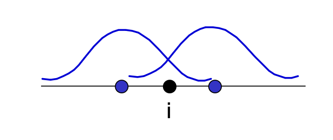
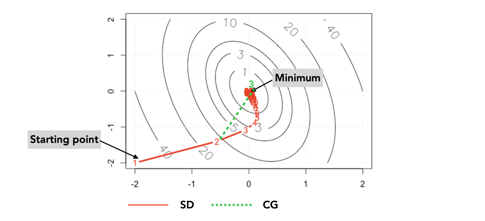
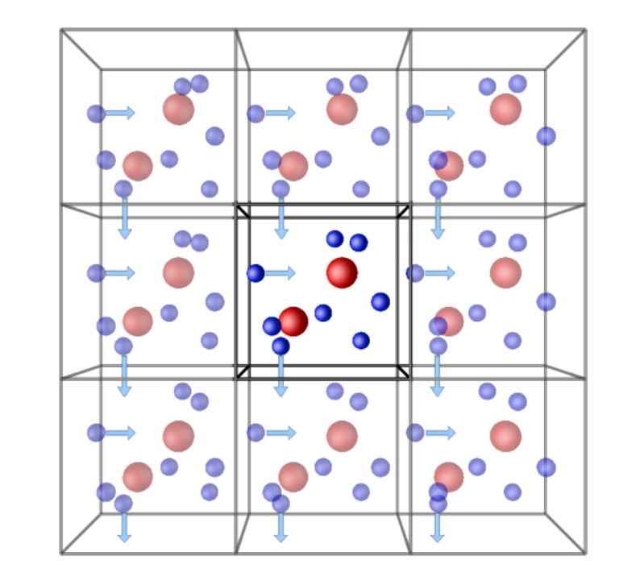

# Force Field 2

## **Embedded Atom model (EAM)**

 Previous parts explain many ways to express parts of modern force fields (and interatomic potentials), however, they are based on **bonds** to describe the fields, which is limited by the system of molecules and crystals. While failed to describe the metallic systems (electron cloud with no directional bonding).  So, to trigger the root, force fields always require the underlying definition of bonds.
$$
p_i = \sum_{i\ne j}f_i(x_i-x_j)
$$
Here $(x_i-x_j)$ is the Euclidean distance between two atoms.

In EAM, the total energy of a metal is assumed to be 

## Optimization methods

To solve the problem of potential energy surface (PBS), we want to calculate the minimum of $E_\text{total}$, which is described by the coordinates.
$$
F(r)=-\frac{dE_\text{total}}{d\vec{r}}\approx-\frac{E_\text{FF}}{d\vec{r}} = 0
$$
where $\vec{r}$ is the coordinate system of reference $x, y, z$

### The Steepest Descent Method

### The Conjugated Gradient Method

$$
\frac{dE_{\text{total},i}}{dr_i}=-g_i+\beta\frac{dE_{\text{total},i-1}}{dr_{i-1}}
$$

several schemes for decide the $\beta$

- $\beta_i^\text{FR}=\frac{g_i^Tg_i}{g_{i-1}^Tg_{i-1}}$
- 

### Mote Carlo

Starting from generating a random move $r_{AB},\theta_{ABC},\phi_{ABCD},r_{BC}....$

$\begin{bmatrix}
r\\s
\end{bmatrix}$

## Periodic boundary condition in simulation

