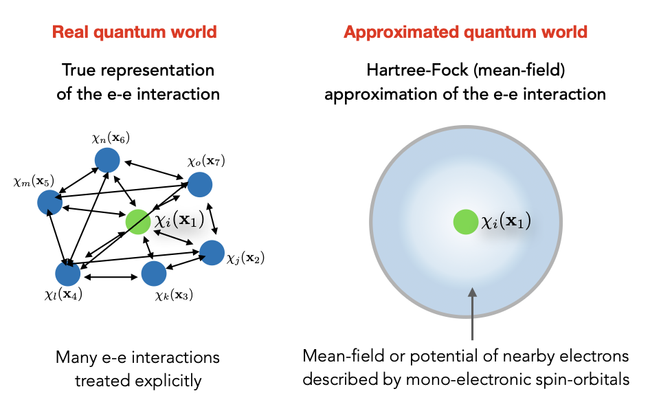

# Hartree-Fock

## Multi-electron $\textbf{Schr\"odinger}$ Equation

$$
\hat{H}=\sum_ih_i + \sum_i\sum_j\frac{1}{r_{ij}}
$$

For a single electron integral $\epsilon_i=\int\mathcal{X_i}^*(x_i)h_i\mathcal{X_i}(x_i)dx_i$

For two electron integral:  $\epsilon_i=\int\mathcal{X_1}^*(x_1)\mathcal{X_2}^*(x_2)h_i\mathcal{X_1}(x_1)\mathcal{X_2}(x_2)dx_1dx_2$

**Energy contribution**

- Coulomb: $J =\int\mathcal{X_1}^*(x_1)\mathcal{X_2}^*(x_2)\frac{1}{|r_{12}|}\mathcal{X_1}(x_1)\mathcal{X_2}(x_2)dx_1dx_2 = \int|\mathcal{X_1}(x_1)^2|\frac{1}{r_{12}}|\mathcal{X_2}(x_2)^2|dx_1dx_2$
- Exchange: $K =\int\mathcal{X_1}^*(x_1)\mathcal{X_2}^*(x_2)\frac{1}{|r_{12}|}\mathcal{X_1}(x_2)\mathcal{X_2}(x_1)dx_1dx_2 $

So, for exchange behavior for electron orbitals with inverse spin, the exchange term will be zero.

## Variational method

In the case we don't know the exact wave function for a problem, we need to guess them. The basic idea of the variational method is to guess a “trial” wave function for the problem, which consists of some adjustable parameters called “variational parameters". These parameters are adjusted until energy of trial wave function is minimized.

Any wave function can be expanded as a linear combination of exact eigenfunction $\Psi_i$
$$
\Psi = \sum_i c_i\Psi_i
$$
And by using a Slater determinant of the trial wave function:
$$
E[\Psi]=\frac{\int\Psi^\star\hat{H}\Psi}{\int\Psi^\star\Psi}\\\Rightarrow
\text{Bu substituting expansion over exact }\Psi\\
E[\Psi]=\frac{\sum_{ij}c_i^\star c_j\int\Psi_i^\star\hat{H}\Psi_j}{\sum_{ij}c_i^\star c_j\int\Psi_i^\star\Psi_j}\\
\Rightarrow \hat{H}\Psi_j = \epsilon_j \Psi_j\\
\text{Since eigenfunctions must form an orthonormal set}\\
E[\Psi] - \epsilon_0 = \frac{\sum_{i}c_i^\star c_i(\epsilon_i-\epsilon_0)}{\sum_{i}c_i^\star c_i}
$$

## Hartree-Fock equation

$$
\left[ 
\hat{h}(\mathbf{x}_1)\chi_i(\mathbf{x}_1) 
+ \sum_j^N \left( \int d(\mathbf{x}_2) \frac{|\chi_j(\mathbf{x}_2)|^2}{r_{12}} \right) \chi_i(\mathbf{x}_1) 
- \sum_j^N \left( \int d(\mathbf{x}_2) \frac{\chi_j^*(\mathbf{x}_2)\chi_i(\mathbf{x}_2)}{r_{12}} \right) \chi_j(\mathbf{x}_1)
\right]
= \epsilon_i \chi_i(\mathbf{x}_1)
$$

The first term:
$$
\sum_j^N(\int d(x_2)\frac{|\chi_j(x_2)|^2}{r_{12}})\chi_i(x_1)
$$
gives the Coulomb interaction of an electron described by a spin-orbital $\chi_i(x_1)$ with the average charge distribution of the other electrons in all other spin-orbitals $\chi_j(x_2).$

Here we can see that Hartree-Fock is a **"mean field theory"**:
$$
\hat{\mathcal{J}}_j(x_1)=\int d(x_2)\frac{|\chi_j(x_2)|^2}{r_{12}}
$$

The other term is exchange term which haas no classical meaning:
$$
\sum_j^N(\int d(x_2)\frac{\chi_j(x_2)^\star\chi_i(x_2)}{r_{12}})\chi_j(x_1)
$$
This seems to be like coulomb term, but the spin-orbital is switched or exchanged for $\chi_i$ and $\chi_j$

In terms of these Coulomb considerably more compact and are: $\mathcal{\hat{J}}_j(x_1)$ and exchange $\mathcal{\hat{K}}_j(x_1)$ operators, the Hartree-Fock equations become
$$
\left[ \hat{h}(\mathbf{x}_1) + \sum_j^N \hat{\mathcal{J}}_j(\mathbf{x}_1) - \sum_j^N \hat{\mathcal{K}}_j(\mathbf{x}_1) \right] \chi_i(\mathbf{x}_1) = \epsilon_i \chi_i(\mathbf{x}_1)
$$

## Linear combination of atomic orbitals (LCAO)

So far, we use variational method that expand the the wave function $\Psi$ in schordinger equations to exact linear combination of $\sum_ic_i\Psi_i$ and use Slater determinant to get trial wave function, $\Psi_i$ also is $\chi_i$ in Hartree-Fock, but what is the shape of spin-orbital $\chi_i$, Roothaan suggested that one can approximate the $\chi_i(x_1)$ as a linear combination of atomic orbitals (LCAO), where the atomic orbitals take the shape of a hydrogen-like orbital (s, p, d, f orbitals):
$$
\mathcal{X_i}=\sum C_{ui}\psi_u\\
\hat{F}(x_1)\mathcal{X_i} =\epsilon_i\mathcal{X_i}(x_1)\\
\Rightarrow \hat{F}(x_1)\sum C_{ui}\psi_u = \epsilon_i\sum C_{ui}\psi_u
$$

- $\psi_u$ is a basis function set, $\psi\in \{\psi_{100},\psi_{200},\psi_{300}\}$

