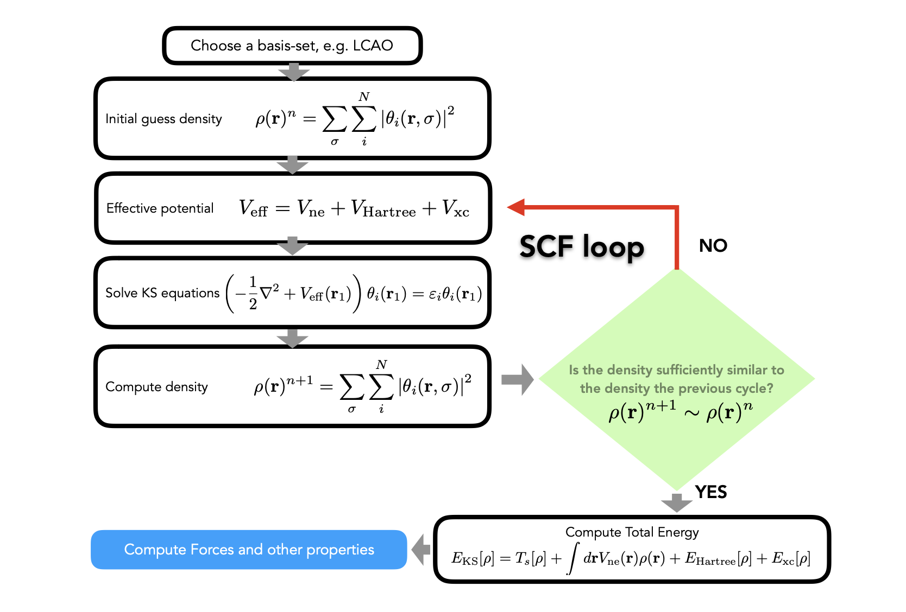

# Lecture 9

### Quick recap of DFT

**Correlation energy:** $E^C = E^\text{exact}-E^\text{HF}$

**Electron density:** $\rho(r)$

**Functional:** $F[\rho(r)]$, input: function, output: value

**Hohenberg-Kohn Theorem:**

- $E[p]\geq E_0, E[p_0]=E_0$
- 

**Kohn-Sham auxiliary system:**

$\hat{H}_\text{aux}=\hat{F}_\text{KS}=-\frac{1}{2}\grad^2+V_\text{eff}(\vec{r})$

------

## The Kohn-Sham Variational Equations

Slater determinant:

$H(\vec{x_1},...,\vec{x_N})=\frac{1}{\sqrt{N}}\begin{vmatrix}\theta_1(\vec{x_1}) & ...& \theta_N(\vec{x_1})\\\theta_N(\vec{x_N}) & ...& \theta_N(\vec{x_N})\end{vmatrix}$

$$
&E_\text{KS}[\rho] = \underset{\text{non interacting kinetic}}{T_s[\rho]} + \underset{\text{external potential}}{\int d\vec{F}V_{ne}(\vec{r})\rho(\vec{r})}+ \underset{\text{Classical couomb interaction}}{E_\text{Hartree}[\rho]} + \underset{\text{exchange-correlation}}{E_xc[\rho]}\\
&= -\frac{1}{2} \sum_i^N \int d\mathbf{r}_1\, |\nabla \theta_i(\mathbf{r}_1, \sigma)|^2 - \sum_i^N \int \sum_A^M \frac{Z_A}{|\mathbf{r}_1 - \mathbf{R}_A|} |\theta_i(\mathbf{r}_1)|^2\\
&\quad + \frac{1}{2} \sum_i^N \sum_j^N \int \! \int d\mathbf{r}_1 d\mathbf{r}_2\,
|\theta_i(\mathbf{r}_1)|^2 \frac{1}{|\mathbf{r}_1 - \mathbf{r}_2|} 
|\theta_j(\mathbf{r}_2)|^2
+ \underset{\text{unknown}}{E_{\mathrm{xc}}[\rho]}
$$
Again, the unknown term is $E_{\mathrm{xc}}[\rho]$. Similarly as what we done in previous Hartree-Fock approximation session, we applied variational principle to make the orbitals $\theta_i(r)$ fulfill in order to minimize this energy.

Recall that, variational principle $\theta_i(r)\rightarrow \delta \theta_i(r), \delta \text{ is the variation factor}$ 
$$
\hat{F}^\text{KS}\theta_i(r_1)=\epsilon \theta_i (r_1)\\
-\frac{1}{2}\grad_1^2 +
$$

## Achieving Self-Consistency of the Kohn-Sham Equations

$$
V_\text{eff} = \underset{\text{constant}}{V_\text{ne}}+\frac{\delta E_H[\rho]}{\delta \rho} +\frac{\delta E_\text{xc}[\rho]}{\delta \rho}
$$

## Finding the Unknown Exchange-Correlation Functionals

\[
\left\{
\begin{aligned}
&\text{1. Chemist (empirical): get }E_\text{xc}\text{ by comparing to experiments}\\
&\text{e.g. heat of formation} \\
&\rightarrow\text{ energy does not guarantee a better functional or }\rho \\
&\text{2. Physicist: build from scratch (based on feature/constraints)}\\
&\rightarrow\text{ limited known features/constraints}
\end{aligned}
\right.
\]

**Local Density Approximation (LDA)**

Assumption: uniform electron gas (metallic)
$$
E_\text{xc}^\text{LDA}=\int\rho(r)\epsilon_\text{xc}[\rho(r)]dr
$$

- where $\epsilon_\text{xc}$ is the exchange-correlation energy per particle of a uniform electron gas of density $\rho(r)$.

The quantity $\epsilon_\text{xc}[\rho(r)]$ exchange and correlation contributions can be spilt as :
$$
\epsilon_\text{xc}[\rho(r)] = \underset{\text{exchange}}{\epsilon_\text{x}[\rho(r)]}+ \underset{\text{correlation}}{\epsilon_\text{c}[\rho(r)]}\\
\rightarrow \text{exchange: }\epsilon_x[\rho(r)]=-\frac{3}{4}\sqrt[3]{\frac{3\rho(r)}{\pi}}\\
\rightarrow \text{correlation: no explicit expression:}\\
\text{fit Quantum Monte Carlo}
$$
**Generalized Gradient Approximation (GGA)**
$$
E_\text{xc}^\text{GGA}=\int f(\rho, \grad\rho)dr
$$
The gradient itself It's more like adding a Tylor expansion, the LDA method is the zero order of the series, while the gradient behaves as polynomials, making it more close the to value.