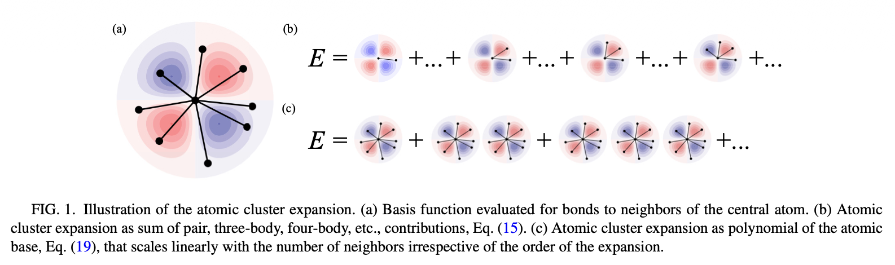

# Atomic Cluster Expansion (ACE)

**Background**

The energy of a system can be assumed  that  the total energy E of the system as a sum of atomic contributions $E_i$
$$
E =	\sum_iE_i
$$
So, it's straightforward to write down the energy of a collection of atoms $i= 1, . . . , N$ in a many-atom expansion:
$$
\begin{aligned}
E =\;& V_0
+ \sum_i V^{(1)}(r_i)
+ \frac{1}{2}\sum_{ij} V^{(2)}(r_i, r_j) \\
&+ \frac{1}{3!}\sum_{ijk} V^{(3)}(r_i, r_j, r_k) \\
&+ \frac{1}{4!}\sum_{ijkl} V^{(4)}(r_i, r_j, r_k, r_l)
+ \cdots
\end{aligned}
$$
$r_i$ is the position of atom $i$ and the potential $V^{(2)}, V^{(3)},...$ are symmetric, uniquely defined, and zero if two or more indices take identical values. Commonly, $V_0$ is a constant offset that can be set to zero and $V^{(1)}$ is the chemical potential

So, the above equation can be written into atomic contributions for each separated energy:
$$
\begin{aligned}
E_i = &\sum_i V^{(1)}(r_i) + \frac{1}{2}\sum_{ij} V^{(2)}(r_i, r_j) \\
&+ \frac{1}{6}\sum_{ijk} V^{(3)}(r_i, r_j, r_k) \\
&+ \frac{1}{24}\sum_{ijkl} V^{(4)}(r_i, r_j, r_k, r_l)
+ \cdots
\end{aligned}
$$
As you can see here, such atomic expansion requires higher order Tylor expansion, the convergence is slow. E,g. Bulk metal potential $V^{(K)}$ up to $K>15$ is required. Even with cutoff that just taking account of nearby atoms within cutoff $r_c$, the evaluation of the leading termof order $K + 1$ in the sum Eq. (3) scales as $N_c^K$, where $N_c$ corresponds to a typical number of neighbors within the cutoff sphere. e.g. for an accurate potentials one requires cutoffs that in a closed packed materials imply $N_c ≈ 10^2 ... 10^3$. It's  challenging to sum expansions within acceptable time.

## ATOMIC CLUSTER EXPANSION

 

We first define the inner product in Hilbert space:
$$
<f|g> = \int f^\star(\sigma)g(\sigma)d\sigma
$$
Next a set of orthogonal and complete basis functions $\phi_v(r)$ with $v = 0,1,2,... $ that depend only on a single bond $r$ are

introduced:
$$
\begin{aligned}
&\int \phi_v(r)^\star\phi_u(r)dr = \delta_{vu}\\
&\sum_v\phi_v(r)^\star\phi_v(r') =\delta(\mathbf{r}-\mathbf{r'})
\end{aligned}
$$
**Define the cluster expansion**

Here we define the basis functions for the expansion of the atomic energy from the product of single-bond basis functions. By choosing $\phi_0= 1$,  a hierarchical expansion is obtained.

A cluster $\alpha$ with $K$ elements contains $K$ bonds $\alpha = (j_{1i},j_{2i},. . . , j_{Ki})$, where the order of entries in $\alpha$ does not matter, and the vector $v = (v_1,v_2,. ..,v_K )$ contains the list of single-bond basis functions in the cluster. Only single-bond basis functions with v > 0 are considered in ν. The cluster basis function is given by:
$$
\Phi_{\alpha v} = \phi_{v_1}(r_{j_1i})\phi_{v_2}(r_{j_2i})...\phi_{v_K}(r_{j_Ki})
$$
And the orthogonality and completeness of the one-bond basis functions can be transferred to cluster basis when $0\le K\le N-1$, $\alpha $ is any arbitrary cluster:
$$
\begin{aligned}
\langle \Phi_{\alpha v} \mid \Phi_{\beta \mu} \rangle
&= \delta_{\alpha\beta}\,\delta_{v\mu},\\
1 + \sum_{\gamma \subseteq \alpha}\sum_v
\Phi_{\gamma v}^*(\boldsymbol{\sigma})\,
\Phi_{\gamma v}(\boldsymbol{\sigma}')
&= \delta(\boldsymbol{\sigma}-\boldsymbol{\sigma}').
\end{aligned}
$$
We abbreviate the left hand inner product as a kernel function: $k(\sigma, \sigma')= 1+ \sum_{\gamma\subseteq \alpha}\sum_v \Phi^\star_{\gamma v}(\sigma)\Phi_{\gamma_v}(\sigma'),$ then the expansion of atomic energy can be written as:
$$
E_i(\sigma) =\langle k(\sigma, \sigma')\mid E_i(\sigma')\rangle = J_0+\sum_{\alpha v} J_{\alpha v}\Phi_{\alpha v} (\sigma)
$$
Where the expansion coefficients $J_{\alpha v}$ are obtained by projection:
$$
J_{\alpha v} = \langle \Phi_{\alpha v}(\sigma)\mid E_i(\sigma)\rangle
$$

