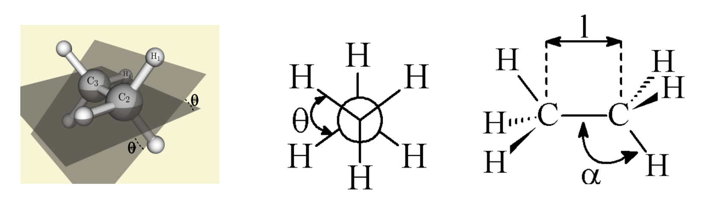
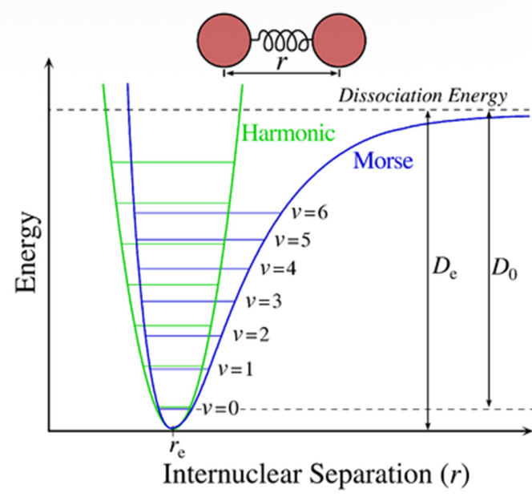
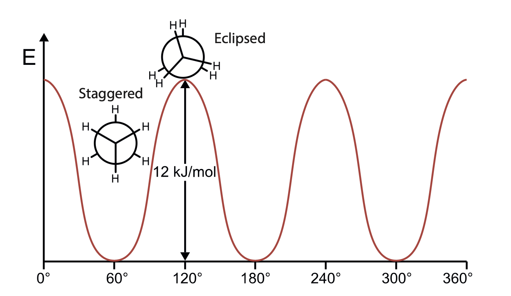
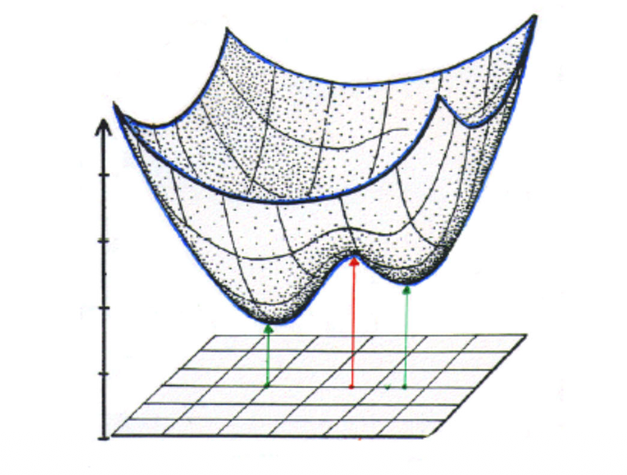

# Empirical forcefields for modeling organic materials

Shortcomings of empirical models:

1. Can not involve bond breaking conditions
2. The more covalent the oxide, the more difficult it will be to find potentials that reproduce the materials behavior in a wide range of environments. Shell polarization is essential in low symmetry environments. Covalent bonds prefer specific angles, while pair wise potential only cares about distance (can not capture 3-body systems).

## Molecular Mechanics force-fields for organic molecules

### Molecular geometry

The geometry of  molecules can be described by 3 part of information

- Bond length $l$
- Bond angle $\alpha$
- Dihedral angle $\theta$

### Energy calculation

$$
E_\text{Total}\approx E_\text{FF} = E_\text{stretching} +E_\text{bending}+E_\text{torsion}+E_\text{vdW}+E_\text{electrostatic}+E_\text{cross}
$$

> [!NOTE]
>
> Its absolute value has no physical meaning. It is only relevant for comparisons between configurations calculated with the same parameter set.

**Bond stretching potentials**

For small displacements Hooke‘s law is a suitable approximation. Cubic and higher polynomial functions or the Morse potential itself describe the bonding situation more accurately, but also increase the computational effort.
$$
V(r) = \frac{k}{2} (r-r_0)^2 \rightarrow \text{for small displacement}
$$

**Bond angle bending potentials**

For a minor angle deformation, an harmonic potential could be used to describe:
$$
V(\alpha) = \frac{k_\alpha}{2}(\alpha-\alpha_0)^2\\
\downarrow \text{A more realistic description using}\cos\\
V(\alpha) = \frac{k_\alpha}{2}(\cos(\alpha)-\cos(\alpha_0))^2\\
$$
**Torsion effect: potential energy vs. dihedral angle**

Since symmetry is involved in the torsion, $V(\theta) = V(\theta+2\pi), V(n\theta)=V(\theta), V(\theta)=V(-\theta)$

 Fourier's expansion:
$$
V(\theta) = a_0 + \sum_{n=1}^{\infty} \left( a_n \cos  (n \theta) + b_n \sin (n \theta) \right),
$$
Since $V(\theta)=V(-\theta)$:
$$
V_\text{torsion}= \sum_{n=1}A_n(1+V_n\cos(n\theta))
$$

**Non-bonded interactions**

The non-bonded energy represents the pairwise sum of the energies of all possible interacting **non-bonded atoms i and j**

- Van der Waals interactions
- Hydrogen bonds
- Dipolar interactions (Coulombic interactions)

**Van Der waals interactions**

$E_\text{vdW}$ becomes zero at very large distances, and becomes very repulsive at short-distances.

Assumption:

1. $E_\text{vdW}$ has positive values (unstable) at small distances
2. $E_\text{vdW}$ displays a minimum that is slightly negative at a distance corresponding to the two atoms just “touching” each other
3. $E_\text{vdW}$ approaches zero when at a very long distance

$$
V_\text{vdW}(x_\text{MN})=V_\text{repulsion}(r)-\frac{C}{r^6}
$$

It's not possible to theoretically derive $V_\text{repulsion}(r)$ form, but it is only required that it goes toward zero as x (the interatomic distance) goes to infinity. And we use L-J potential to approximate that.
$$
V(r) = \frac{A}{r_{ij}^{12}}-\frac{B}{r_{ij}^6}
$$
**Electrostatic interactions**

The electrostatic energy is a function of the charge on the non-bonded atoms, their interatomic distance, and a molecular dielectric expression $\epsilon$ that accounts for the attenuation of electrostatic interaction by the environment (e.g. solvent or the molecule itself)
$$
V(r)_\text{coulmb}=\sum_i\sum_j\frac{q_iq_j}{\epsilon r_ij}
$$
**Cross terms**

To deal with exceptional conditions:

1. Bond length are not absolute, it depends on bond angle or other bond lengths.
2. Planarity of small rings is not always described properly. e.g. Molecules like cyclobutane are not actually flat

$$
V_{r\alpha}=k_{r\alpha}(r-r_0)(\alpha-\alpha_0)\\
V_{\alpha,\theta}=k_{\alpha,\theta}(\alpha-\alpha_0)(\theta-\theta_0)
$$

## Potential Energy Surface

The energy landscape vs. parameters (>1)

In the simple 2-parameter example below the potential energy surface (PES) has 2 minima (stable structures) and 1 saddle point (= transition state) in-between.

Since there are many local minimum points in the PES, to determine whether a stationary point (first order derivative = zero) is an global minimum, the $2^\text{nd}$ derivative should be determined. As the energy depends on n coordinates, we got a $n\times n$ matrix of the second order derivatives, the so called **Hessian matrix** or **Hessian**
$$
H =
\begin{bmatrix}
\frac{\partial^2 f}{\partial x_1^2} & \cdots & \frac{\partial^2 f}{\partial x_1 \partial x_n} \\
\vdots & \ddots & \vdots \\
\frac{\partial^2 f}{\partial x_n \partial x_1} & \cdots & \frac{\partial^2 f}{\partial x_n^2}
\end{bmatrix}
$$
Let $x_0$ be an stationary point, $\nabla f(x_0)=0$:

$f(x_0+h)=f(x_0)+\nabla f(x_0)h+\frac{1}{2}h^THh = f(x_0)+\frac{1}{2}h^THh$

Since H is symmetrical due to partial derivative commute rules, $\rightarrow H^T=H$

$H=Q\Lambda Q^T$, where $Q$ is an orthogonal matrix, $\Lambda = \text{diag}(\lambda_1, ..., \lambda_n)$

$h^THh = h^TQ\Lambda Q^Th \xrightarrow{y = Q^T h} y^T \Lambda y=y\Lambda y^T=\sum_i\lambda_iy_i^2$

So, $f(x_0+h)-f(x_0) = \frac{1}{2}\sum_i\lambda_iy_i^2$

If $\frac{1}{2}\sum_i\lambda_iy_i^2>0$, 

Local minimum is geometries of metastable states $\sum_i\lambda_iy_i^2>0$

Global minimum is equilibrium geometry of the molecule $\lambda_i(x) > 0 \quad \forall i, \forall x$

- Energy Minimum (The Goal): All eigenvalues are positive.
- Hilltop (Maximum): All eigenvalues are negative.
- Saddle Point (Transition State): One eigenvalue is negative, while the others are positive.

## Numerical determination of energy minima

**Steepest descent**

**Require:** Initial point $x_0 \in \mathbb{R}^n$, differentiable objective function $f(x)$, convergence tolerance $\epsilon > 0$, maximum iterations $k_{\max}$.

1. **Initialize:** Set iteration counter $k \gets 0$.

2. **While ** $\|\nabla f(x_k)\| > \epsilon$ **and** $k < k_{\max}$ **do**:

   

   1. **Compute search direction:**

      $d_k \gets -\nabla f(x_k)$

   2. **Line search:** Find the optimal step size $\alpha_k$ by solving the one-dimensional optimization problem:

      $\alpha_k \gets \arg\min_{\alpha > 0} f(x_k + \alpha d_k)$

   3. **Update iterate:**

      $x_{k+1} \gets x_k + \alpha_k d_k$

   4. **Increment iteration counter:**

      $k \gets k + 1$

3. **End While**

4. **Return:** $x^* \approx x_k$ as the approximate minimizer.

**Conjugated gradient descent**

**Require:** Initial point $x_0 \in \mathbb{R}^n,$ differentiable function $f(x)$, tolerance $\epsilon > 0$, maximum iterations $k_{\max}$.

1. **Initialize:**

   

   - Set iteration counter $k \gets 0$
   - Compute initial gradient: $g_0 \gets \nabla f(x_0)$
   - Set initial search direction: $d_0 \gets -g_0$

2. **While** $\|g_k\| > \epsilon$ **and** $k < k_{\max}$ **do**:

   1. **Line search:**

      $\alpha_k \gets \arg\min_{\alpha>0} f(x_k + \alpha d_k)$

   2. **Update iterate:**

      $x_{k+1} \gets x_k + \alpha_k d_k$

   3. **Compute new gradient:**

      $g_{k+1} \gets \nabla f(x_{k+1})$

   4. **Compute conjugate coefficient (Polak–Ribiere):**

      $\beta_k \gets \frac{g_{k+1}^T (g_{k+1} - g_k)}{g_k^T g_k}$

   5. **Update search direction:**

      $d_{k+1} \gets -g_{k+1} + \beta_k d_k$

   6. **Increment iteration counter:** $k \gets k + 1$

3. **End While**

4. **Return:** $x^* \approx x_k$ as the approximate minimizer

**Newton Raphson method**

**Require:** Initial guess $x_0 \in \mathbb{R}^n$, twice-differentiable function $f(x)$, tolerance $\epsilon > 0$, maximum iterations k_{\max}.

1. **Initialize:** Set iteration counter $k \gets 0.$

2. **While** $\|\nabla f(x_k)\| > \epsilon$ **and** $k < k_{\max}$ **do**:

   1. **Compute gradient and Hessian:**

      $g_k \gets \nabla f(x_k), \quad H_k \gets \nabla^2 f(x_k)$

   2. **Compute search direction:**

      $d_k \gets - H_k^{-1} g_k$

   3. **Update iterate:**

      $x_{k+1} \gets x_k + d_k$

   4. **Increment iteration counter:** $k \gets k + 1$

3. **End While**

4. **Return:** $x^* \approx x_k$ as the approximate solution