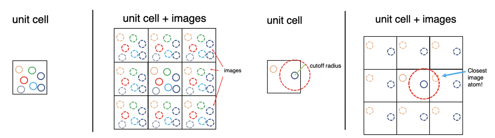
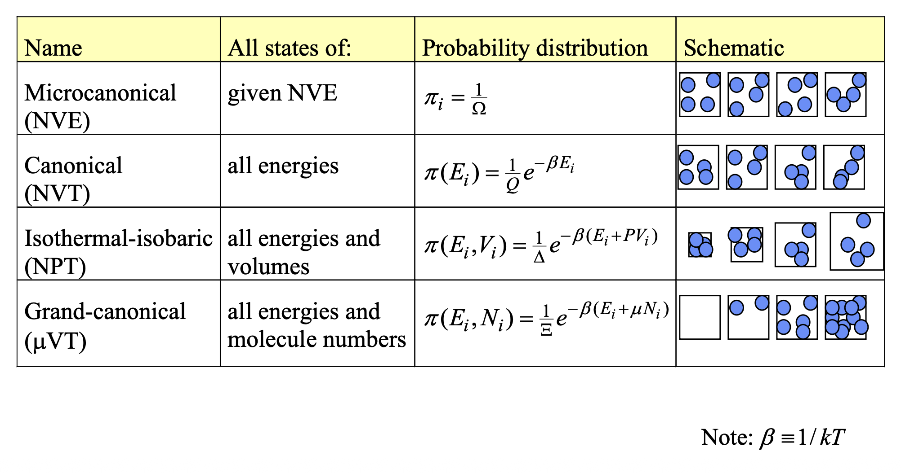
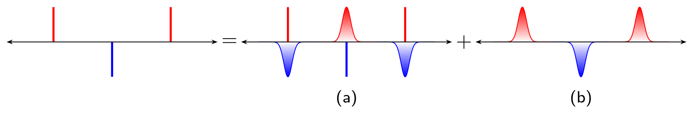

# Boundary Conditions & Ensembles

## 1. The theoretic foundation

### 1.1. Boundary Conditions

Due to the infinite size of the system, any atomistic simulation of macroscopic condensed matter can only cover a comparatively small detail of its atomic arrangement.

**Periodic boundary conditions** (**PBCs**) are a set of [boundary conditions](https://en.wikipedia.org/wiki/Boundary_condition) that are often chosen for approximating a large (infinite) system by using a small part called a *unit cell*. 

During the simulation, each particle in the simulation only interacts with the closest image of the remaining particles. Which is called <u>minimum image convention</u>

### 1.2. Statistical mechanics in MD

Two postulates for equilibrium statistical mechanics:

- Microstates of equal energy are equally like
- Time average is equivalent to ensemble average ("ergodicity")

For  a dynamical system defined by a state space $\Omega$, a probability measure $\mu$, and a measure-preserving transformation $T:\Omega\rightarrow\Omega $, given a measurable function $f$ :

The time average: $\bar{f_t} = \displaystyle \lim_{T \to +\infty} \frac{1}{T} \int_0^T f(x(t))\, dt$

The ensemble average: $\langle f \rangle=\int_\Omega f(x)d\mu(x)$

**The Ergodic Hypothesis** states that for an ergodic system: $\bar{f_t}=\langle f\rangle$

### 1.3. Ensembles

A ensemble is a collection of microstates subject to at least one **extrinsic** constraint. (Extensive property is the property that scale with the environment)

Recall that the Boltzmann distribution:
$$
p_i=\mathcal{Z}\, \exp(-\frac{\varepsilon_i}{K_BT})
$$

- $p_i$ is the probability of the system in state $i$
- $\varepsilon_i$ is the energy of the state $i$
- $K_B$ is Boltzmann constant, $T$ is the temperature
- $\mathcal{Z}$ is the normalization factor, $\sum_i \exp(-\frac{\varepsilon_i}{K_BT})$

## 2. The movement of atoms

How the atoms interact with each other. **Equation of motion:**

1. Newtonian 
2. Lagrangian
3. Hamiltonian

### 2.1. **Newtonian motion**: from force and acceleration perspective

$$
m_i\frac{dr_i}{dt^2} = F_i = \nabla_{r_i} V(r_1,...,r_N)
$$

### 2.2. **Lagrangian motion:** From energy and path

Lagrangian mechanics shifts the focus from forces and Cartesian coordinates to energy and "generalized coordinates." It is based on the <u>Principle of Least Action</u>—the idea that a system will evolve along a trajectory that minimizes a quantity called the "action."

we define the Lagrangian $(\mathcal{L})$ as the difference between the total kinetic energy ($K$) and total potential energy ($V$) of the system on a **generalized coordinate** $q$ and generalized velocity $\dot{q}$ .
$$
\mathcal{L}(q,\dot{q})=K(\dot{q})-V(q)
$$

> [!NOTE]
>
> **Generalized coordinates** are the absolute minimum number of independent variables required to completely define the configuration of a system, taking any physical constraints into account. They are conventionally denoted by the symbol $q$.
>
> $f=3N-m$, the number of generalized coordinates $q_1,q_2,...,q_f $ needed. 
>
> e.g. A Rigid Diatomic Molecule in MD ($\{q_1,q_2, q_3,...,q_6\}\rightarrow \{x,y,z,\theta,\phi\} $)
>
> 2-D motion in central field $\{q_1,q_2\} =\{r,\theta\}$

The equations of motion are generated by solving the Euler-Lagrange equation for each degree of freedom:
$$
\frac{d}{dt}(\frac{\partial\mathcal{L}}{\partial\dot{q}})-\frac{\partial \mathcal{L}}{\partial q}=0
$$

- $q$: A generalized coordinate. This doesn't have to be an $x,y,z$ position; it could be an angle, a bond length, or any coordinate system that naturally describes the system.
- $\dot{q}$: The generalized velocity (the time derivative of the generalized coordinate $q$).

### 2.3. **Hamiltonian motion:** Phase space and Statistical mechanics

While Newtonian and Lagrangian motion take $q_i$ as fundamental variable and seeks for $N$ $ 2^{nd}$ derivatives. The Hamiltonian seeks for $2N$ first order derivative. It treats coordinate and its time derivative as independent variables.

First, we define the Hamiltonian ($\mathcal{H}$), which represents the total energy of the system (for standard conservative systems):
$$
\mathcal{H}(q,p) = K(p) + V(q)
$$

- $q$: The generalized coordinate.
- $p$: The generalized momentum, $p =\frac{\partial \mathcal{L}}{\partial \dot{q}}$

The motion of the system is described by Hamilton's equations:
$$
\dot{q} = \frac{\partial \mathcal{H}}{\partial p}\\
\dot{p} = -\frac{\partial \mathcal{H}}{\partial q}
$$

- $\dot{q}$ is the time derivative of the generalized coordinate.
- $\dot{p}$ is the time derivative of the generalized momentum $\dot{p} = \frac{dp}{dt}$, which is equivalent to force. 

> [!TIP]
>
> **Legendre transform**
>
> Since $q,\dot{q}$ is the variables of  $\mathcal{L}$, we want to $p$ as independent variable, transform $\dot{q}\rightarrow p$, $p =\frac{\partial \mathcal{L}}{\partial \dot{q}}$
>
> $H(q,p)=p\dot{q}-\mathcal{L}(q,\dot{q})$

## 3. Time integration algorithms

## 4. Temperature and Pressure dependent MD

For standard MD, it assumes an isolated system with constant energy. However, real world simulation is under const temperature or pressure. So, how to artificially add or remove energy to keep the temperature or pressure constant is a problem.

**The thermodynamic definition of temperature **
$$
\frac{1}{T}=(\frac{\partial S}{\partial E })_{V,N}\\
\frac{1}{KT}=\frac{\partial}{\partial E}\ln\Omega(E, V, N)
$$

- $\Omega$ is Num of microstates with given E

So, temperature defines the how much more disordered of a system given amount of energy. 

high temperature: adding energy opens up few additional microstates. 

low temperature: adding energy opens up many additional microstates

**An Expression for the Temperature** under NVE (microcanonical)

In the microcanonical ensemble, temperature is defined fundamentally through entropy S:
$$
S=k\ln\Omega(E)\\
\frac{1}{KT}=\frac{\partial}{\partial E}\ln\Omega(N,V,E)=\frac{1}{\Omega}\frac{\partial \Omega}{\partial E}
$$
<u>The geometric definition of $\Omega$</u>

$\Omega$ is the number of states or Density of states. Let $\Phi(E)$ be the total phase-space volume inside the energy contour $E$, $N$ is the dimension of this phase space.
$$
\Phi(E)=\int_{E(x)<E}d^Nx
$$
The density of states $\Omega(E)$ is the rate of change of this volume with respect to energy. 
$$
\Omega(E)=\frac{\partial \Phi(E)}{\partial E}=\int\frac{1}{\partial E} (\frac{\nabla_x E}{|\nabla_x E|}ds)=\int_{E=E(x)}\frac{1}{|\nabla_x E|}ds
$$

- $s$ is the area of the hyper surface.

**Expression for the Temperature**

$$
\frac{1}{KT}=\frac{\nabla^2_x E}{|\nabla_x E|^2}
$$

### 4.1. Momentum temperature

Kinetic energy: $K(p^N)=\sum_i^N\frac{p_i^2}{2m}$

Gradient: $\nabla_p K=\sum_i^N(\frac{p_{ix}}{m}\hat{e}^{ix}+\frac{p_{iy}}{m}\hat{e}^{iy}+...+\frac{p_{id}}{m}\hat{e}^{id})$

Laplacian: $\nabla^2_pK=\nabla\cdot\nabla_pK=\sum_i^N(\frac{1}{m}+...+\frac{1}{m})=\frac{Nd}{m}$

Temperature: $kT=\frac{|\nabla_p K|^2}{\nabla_p^2 K}=\frac{m}{Nd}\times\sum_i^N((\frac{p_{ix}}{m})^2+(\frac{p_{iy}}{m})^2+...+(\frac{p_{id}}{m})^2)=\frac{1}{Nd}\sum_i^N\frac{p_{i}^2}{m}$

### 4.2. Configurational Temperature

Potential energy: $U(r^N)$

Gradient: $\nabla_r U=\sum_i^N\frac{\partial U}{\partial r_{ix}}\hat{e_{ix}}+...+\frac{\partial U}{\partial r_{id}}\hat{e_{id}}=-\sum_i^N(F_{ix}\hat{e_{ix}}+...+F_{id}\hat{e_{id}})$

Laplacian: $\nabla^2_rU=\nabla\cdot\nabla_rU=-\sum_i^N(\frac{\partial F_{ix}}{\partial r_{ix}}+...+\frac{\partial F_{iy}}{\partial r_{iy}})$

Temperature: $kT=\frac{|\nabla_r U|^2}{\nabla_r^2 U}=-\frac{\sum_i^N \hat{F_i}^2}{\sum_i^N(\frac{\partial F_{ix}}{\partial r_{ix}}+...+\frac{\partial F_{iy}}{\partial r_{iy}})}$

## 5. Types of Thermostats

In canonical ensemble, the $N, V, T$ are fixed. The temperature of the system can be connected to the kinetic energy by the momentum temperature:
$$
KT =\frac{|\nabla_p K|^2}{\nabla_p^2 K} = \frac{1}{Nd}\sum_i^N\frac{p_i^2}{m}=\frac{2}{Nd}\langle E_K\rangle\\
\downarrow \text{when d=3, in Cartesian coordinate}\\
\frac{3}{2}NKT = \langle E_K\rangle
$$

Although the temperature and the average kinetic energy are fixed, the instantaneous kinetic energy fluctuates and with it the velocities of the particles. The instantaneous kinetic energy is often used to define the instantaneous temperature $T_\text{in}$ by:
$$
k_B T_{\mathrm{in}} = {2\over 3N} E_{\mathrm{kin}}
$$
But in <u>NVE micro-canonical ensemble</u>, the temperature is characterized by $\frac{1}{T}=\partial S/\partial E$, there is no connection between kinetic energy and temperature.

Because the temperature fluctuates in the finite systems as we introduced above, so the goal of thermostat is to ensure the time average of $T(t)$ is matched with target temperature $T_\text{target}$ 

### 5.1. Velocity Rescaling (Simple but Flawed)

The simplest way to control temperature is to periodically multiply all particle velocities by a scaling factor.
$$
\mathbf{v}_i^{new} = \lambda \mathbf{v}_i^{old} \quad \text{where} \quad \lambda = \sqrt{\frac{T_\text{target}}{T(t)}}
$$
It's computationally cheap and brings the system exactly to the target temperature. However, it does not follow the natural kinetic energy fluctuations of the canonical ensemble, leading to incorrect thermodynamic properties. So, it's generally only used in equilibrium conditions.

And the typical example is Berendsen and Andersen Thermostat.

#### 5.1.2 Berendsen Thermostat

The Berendsen thermostat weakly couples the system to an external heat bath. It forces the temperature to exponentially decay towards the target value.
$$
\frac{dT}{dt} = \frac{T_{target} - T(t)}{\tau}
$$

- $\tau$: The coupling time constant (relaxation time). A small $\tau$ means tight coupling (faster temperature adjustment), while a large $\tau$ means weak coupling.

$$
\lambda = \sqrt{1+\frac{\Delta t}{\tau}(\frac{T_\text{target}}{T(t)}-1)}
$$

### 5.2. Stochastic Thermostat

#### 5.2.1. Andersen Thermostat

The Andersen thermostat introduces stochastic (random) collisions with a virtual heat bath. Periodically, a particle is selected at random, and its velocity is reassigned from a Maxwell-Boltzmann distribution corresponding to the target temperature.

The probability of a particle undergoing a collision in a discrete time step $\Delta t$ is governed by a collision frequency:
$$
P(\text{collison})=\nu \Delta t
$$
And the Continuous Waiting Time Distribution describes the waiting time between consecutive collisions for a single particle.
$$
p(t;\nu) = \nu e^{-\nu t}
$$

#### 5.2.2. Langevin Thermostat

The equation for Langevin dynamics:
$$
m\frac{d^2r}{dt^2}=-\nabla_rU(r_1,...,r_N)-\gamma mv_i+R_i
$$

- $\nabla U$ is the conservative force.
- $\gamma$: The collision frequency or friction coefficient.
- $v_i$: Velocity of the particle.
- $R_i$: The random (Gaussian) force.

**Velocity-Verlet algorithm for Langevin thermostats**
$$
\begin{align}
\mathbf{v}_i(t + {\delta t\over 2}) &= \mathbf{v}_i(t) + {\delta t \over 2m} \left[
                                           \mathbf{F}_i - \gamma m \mathbf{v}_i
                                       \right] + \mathbf{R}_i
\end{align}
$$

#### 5.2.3. Nosé-Hoover Thermostat (Extended Lagrangian Method)

In Nosé-Hoover’s approach, an additional “agent” is introduced into the system to “check” whether the instantaneous kinetic energy is higher or lower than the desired temperature and then scales the velocities accordingly, effectively acting as a heat reservoir.

## 6. Truncating the Potential and Ewald Summation

### 6.1. Truncating the Potential

Any potential truncation introduces discontinuity, near cutoff $(r<r_\text{cutoff})$ the potential is continuous, at $r_\text{cutoff}$, $U$ is 0. Such phenomenon introduces infinite force near $r_\text{cutoff}$

**Shifted potentials**

It removes infinite forces, but still discontinuity in force.
$$
u(r) = \begin{cases} 
u(r) - u(r_c) & r \leq r_c \\ 
0 & r > r_c 
\end{cases}
$$
**Shifted-force potentials**

Routinely used in MD
$$
u(r) = \begin{cases} 
u(r) - u(r_c) - \frac{du}{dr}(r-r_c) & r \leq r_c \\ 
\qquad \qquad 0 & r > r_c 
\end{cases}
$$

### 6.2. Ewald Summation

If we need to calculate the total electrostatic energy of a periodic system of point charges, the direct approach is to sum the coulomb interactions for pair-wise charges. However, recall that bulk system are usually simulated with periodic boundary conditions by cutoff. Due to minimum image convention, it only interact with nearest image. 
$$
U_\text{coulomb}=\sum_{i=1}^N\sum_{j=1}^N\sum_L^\prime\frac{q_iq_j}{|r_{ij}+L|}
$$
The prime (′) indicates that we do not include the interaction of a charge with itself in the same unit cell ($i=j$ when $L=0$, no translation).

- $L$ is the lattice vector of $L^{th}$ unit cells.

Due to the slow convergence of $\frac{1}{r}$, and the number of interacting particles in a 3D space grows as $r^2$. The potential will increase with $U_\text{total}\propto \int_0^\infty rdr\rightarrow \infty$ (for single type shell charges), and in real crystals they are conditionally converge. 

So, to deal with slow convergence, Ewald propose to calculate the potential splitter into a **short-range** part calculated in real space, and a **long-range** part calculated in reciprocal (Fourier) space.
$$
U = U_\text{sr} + U_\text{lr} = \frac{f(\lambda(r))}{r} + \frac{1-f(\lambda(r))}{r}\\
=\frac{\text{erfc}(r)}{r}+\frac{1- \text{erfc}}{r}
$$

- $f(\lambda(r))$ is a fast decay function
- $\lambda$ is the parameter that determines how fast the function decays.

The main idea of Ewald summation is to separate long-range interactions by screening at the real space. By wrapping every point charge in a diffuse cloud of opposite charge. Imaging if we are standing far away from this atom, the positive point charge and the negative Gaussian cloud perfectly cancel each other out. So, we only need to calculate the pair wise potential in the cut off range.
$$
\rho_\text{screen}(r)=-q(\frac{\alpha}{\sqrt{\pi}})^3(e^{-(\alpha (r-r_0))^2})
$$

- Ewald parameter  $\alpha$ that determines how wide or tight the Gaussian cloud is.
- $|r-r_0|$ is the distance from the center of the point charge.
- $q$ is the charge of central particle.

At the same time, we need to compensate such fake screening clouds, we superimpose a positive compensating cloud in the exact same location to cancel the fake one out.

In Ewald summation, complementary error function is chosen as the decay function:
$$
\operatorname{erfc}(r) = 1- \operatorname{erf}(r)
    \qquad
    \operatorname{erf}(r) =  \frac{2}{\sqrt\pi} \int_0^r e^{-t^2} \,\mathrm{d}t;
$$

**Real space summation**

Now we can calculate the short range potential caused by such smooth charge distribution:
$$
U_{sr} = \sum_{i=1}^N\sum_{j=1}^N\sum_L^\prime q_iq_j\frac{\operatorname{erfc}(\alpha|r_{ij}+L|)}{|r_{ij}+L|}
$$

**Reciprocal space summation**

Due to the periodicity of crystals, the particles interact with compensated cloud should follow the periodicity. The standard way to solve the math of periodic waves is to use a Fourier transform to switch from real space into reciprocal (momentum) space. And the Fourier transform of a Gaussian is another Gaussian.

$$
U_{lr}= \frac{1}{2V}\sum_{k\neq 0}\frac{4\pi}{k^2}e^{-k^2/4\alpha^2}|\sum_{j=1}^Nq_je^{-ik\cdot r_j}|^2
$$
> [!TIP]
>
> Fourier transformation of Gaussian, for $1D$ Gaussian $g(x)=e^{-\alpha x^2}$:
> $$
> \mathcal{F}(g(k))=A\int_{-\infty}^{+\infty} e^{-\alpha x^2}e^{-ikx}dx=Ae^{-k^2/4\alpha}\int_{-\infty}^{+\infty} e^{-\alpha(x+\frac{ik}{2\alpha})^2}dx\\
> =A\sqrt{\frac{\pi}{\alpha}}e^{-k^2/4\alpha}\Leftarrow\int_{-\infty}^{+\infty}e^{-\alpha(z+b)^2}dz=\sqrt{\frac{\pi}{\alpha}}\\
> =A\sqrt{\frac{\pi}{\alpha}}^ne^{-(k_1^2+...+k_n^2)/4\alpha}
> $$
>

Here the normalization factor $A=\frac{1}{\sqrt{\Omega}}$, $\Omega$ is the volume of the $n$ dimension space. Proof bellow:
$$
f(k) = A\int_\Omega f(r)e^{-ikr}d^nr\\
f(r) = A\sum_k f(k)e^{ikr}
=A^2\sum_k\int_{\mathbb{R}^n}f(r)e^{ikr-ik^\prime r}d^nr\\
=f(r)A^2\Omega\delta_{k,k^\prime}\Rightarrow A^2\Omega=1\rightarrow A=\frac{1}{\sqrt{\Omega}}
$$

The let's first get the distribution of the compensation smooth distribution.
$$
\rho_\text{compensate}(r) =  -\rho_\text{screen}(r+L) = \sum_L\sum_{i=1}q_i(\frac{\alpha}{\sqrt{\pi}})^3e^{-\alpha^2|r-r_i+L|^2}
$$
Since $\rho_\text{compensate}$ is perfectly periodic, calculating them in real space is hard. So, we use above **Fourier transformation** to convert it into reciprocal space.
$$
\rho_\text{compensate}(k)
=\int\rho(r)e^{ikr}d\mathbf{r}=\frac{1}{\sqrt{\Omega}}\int q_i(\frac{\alpha}{\sqrt{\pi}})^3 \sum_i\sum_Le^{-\alpha^2|\mathbf{r}-r_i+L|^2}e^{ik\mathbf{r}}d\mathbf{r}\\
=\frac{1}{\sqrt{\Omega}}\sum_L\sum_{i=1}q_ie^{-\mathbf{k}^2/4\alpha^2}\cdot e^{i\mathbf{k}r_i}\cdot e^{i\mathbf{k}L}\\
=\sqrt{\frac{N}{V}}\sum_iq_ie^{-\mathbf{k}^2/4\alpha^2}\cdot e^{i\mathbf{k}r_i}
$$

- Recall that $e^{ikL}=1$ and $\sum_Le^{ikL}=N\delta_{k,L}$, L is lattice vector.
- $\delta_{k,G} = 1$ if $k_j$ and $L_j$ share same index. And orthogonal if share different index $j$
- $N$ and $V$ is the number and volume of unit cells, respectively.
- $\Omega$ is volume of the periodic materials: $\Omega=NV$.

The charge and electrostatic potential are related by Poisson’s equation in real space

$$
\phi(r)=\frac{q}{r}\rightarrow E(r)=\frac{q}{r^2}\\
\oint EdV\overset{\text{for sphere}}{\rightarrow}\oint EdA=4\pi Q\\
\phi(r)=\nabla E(r)=4\pi\rho(r)
$$
Pay attention, here we use **Gaussian (cgs) units** instead of **SI** units ($\AA$), if we use SI units $\phi(r)=\frac{\rho(r)}{\epsilon_0}$

Now, we substitute the $\rho$ with the electrostatic potential:
$$
-k^2\phi(k) = 4\pi\rho(k)
$$

$$
\phi_\text{compensate}(k)=\sqrt{\frac{N}{V}}\sum_iq_i\frac{4\pi}{k^2}e^{-k^2/4\alpha^2}\cdot e^{ikr_i}
$$

And we get the potential:
$$
U_{lr}(r)=\sum_m\sum_r\frac{1}{2}\phi(r)q_m\\
\Downarrow \text{Fourier transformation}\\
U_{lr}(k)=\sum_m\sum_k\frac{1}{2V}\phi(k)q_me^{ikr_m}
$$

$$
U_{lr}(k)=\sum_k\frac{1}{2V}(\frac{4\pi}{k^2})(\sqrt{\frac{N}{\Omega}}\sum_i^N\sum_j^Nq_iq_je^{-k^2/4\alpha^2}\cdot e^{ik(r_i-r_j)})\\
=\frac{1}{2V}\sum_{k\neq0}\frac{4\pi}{k^2}e^{-k^2/4\alpha^2}\sum_i^N\sum_j^Nq_iq_j\cdot e^{ik(r_i-r_j)}
$$

**Self correction term**

This is a constant correction term applied to remove the interaction of a charge's compensating cloud with the charge itself, which was inherently included in the reciprocal sum.
$$
U_\text{self} = -\frac{\alpha}{\sqrt{\pi}}\sum_iq_i^2
$$

## Radial distribution function (RDF)

$$
g(r)=\frac{\rho(r)dr}{\rho^{id}(r)dr}\rightarrow
\rho^{id}(r)=\frac{N}{V}dr
$$

- $g(r)=1$ as $r>r_\text{cutoff}$, meaning the structure becomes uniform at long distances.
- $g(r)=0$ as $r=0$ due the core repulsion between atoms.

[1]: http://staff.ustc.edu.cn/~zqj/posts/Ewald-Summation	"Ewald Summation post by Qijing Zheng"
[2]: http://staff.ustc.edu.cn/~zqj/posts/NVT-MD/	"Molecular Dynamics at Constant Temperature"

