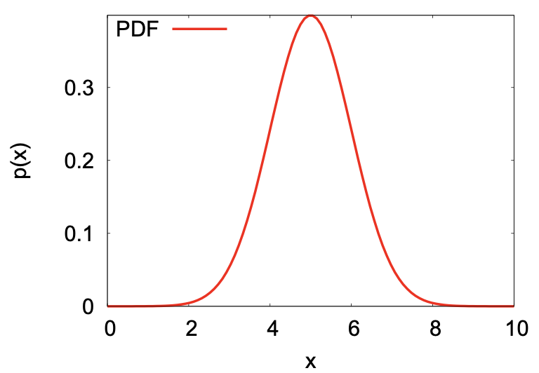
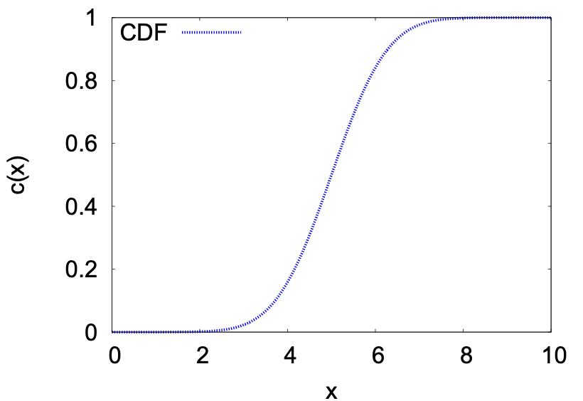

# Monte Carlo Integration and Monte Carlo Simulation

## 1. Foundations of Monte Carlo & Random Sampling

### 1.1. **Statistical Approaches to Numerical Estimation**

Monte Carlo (MC) methods are a broad class of computational algorithms which rely on repeated random sampling to obtain the distribution of an unknown, often probabilistic entity. They are particularly useful for problems in which it is difficult (or impossible) to obtain a closed-form expression, or to apply a deterministic algorithm

To get the estimation of a function or integral, we have two approaches:

- Methodical Integration: You pick points on a rigid, evenly spaced grid, like in the trapezoid or Simpson's rule
- Monte Carlo Integration: You pick points entirely at random

### 1.2. Importance sampling

When evaluating high-dimensional integrals for molecular systems, simple uniform random sampling is incredibly inefficient. we can deliberately generate samples according to a distribution that focuses on the minuscule regions that actually contribute to the integral.

**Probability distribution function (PDF)**

  $$P(a \le X \le b) = \int_a^b p(x)\,dx$$ 

**Cumulative distribution function (CDF)**

 $$C(x)=\int p(x)dx\\p(x)=\frac{dc(x)}{dx}$$ 

**Cauchy distribution (Lorentz distribution)**
$$
C(x) = \frac{1}{\pi}\arctan\frac{x-x_0}{\gamma}+\frac{1}{2}\\
f(x|x_0,\gamma)=\frac{1}{\pi\gamma[1+(\frac{x-x_0}{\gamma})^2]}
$$

- $\gamma$: The scale parameter, which represents the half-width at half-maximum (HWHM).

**Gaussian distribution**
$$
f(x|\mu,\sigma) = \frac{1}{\sigma\sqrt{2\pi}}e^{-\frac{1}{2}(\frac{x-\mu}{\sigma})^2}
$$

### 1.3. Random sampling

Monte Carlo methods require a source of randomness. It is desirable that these random numbers are delivered as a stream of $U[0,1]$ independent random variables. It is a necessity to generate random numbers uniformly, such that bias is not introduced into any physical property we wish to predict or estimate. 

**(Pseudo-)Random Number Generation**

1. Multiple recursive congruential generator (MRG)
   $$
   x_i \equiv  a_1x_{i-1} + a_2x_{i-2} + \ldots + a_kx_{i-k} \pmod M
   $$

2. Lagged Fibonacci generator (LFG)

$$
\begin{aligned}
x_i \equiv x_{i-r} + x_{i-s} \pmod M ,
\end{aligned}
$$

## 2. Markov Processes & Metropolis Algorithm

### 2.2 Markov Processes

**Stochastic process** is a movement through a series of well-defined states in a way that involves some element of randomness. And **Markov process** is stochastic process that has no memory,  selection of next state depends only on current state, and not on prior states. $P(x_t|x_{t-1},x_{t-2},...,x_{t0})=P(x_t|x_{t-1})$

**Transition probability matrix**

And such probability is defined by the transition matrix $\pi_{ij}$, probability of selecting state $j$ next with given the present state $i$
$$
\Pi \equiv \begin{pmatrix} 
\pi_{11} & \pi_{12} & \pi_{13} \\ 
\pi_{21} & \pi_{22} & \pi_{23} \\ 
\pi_{31} & \pi_{32} & \pi_{33} 
\end{pmatrix}
$$

- $\pi_{11}$ is the probability of stay in state 1 if the system is currently in state 1.
- $\pi_{13}$ is the probability of move in state 3 if the system is currently in state 1.
- $\pi_{32}$ is the probability of move in state 2 if the system is currently in state 3.

Requirement of transition matrix:

1. $0\leq p_{ij}\leq 1$
2. $\sum_{j}p_{ij}=1$

**n-step transition probability matrix**

e.g. for 2 step transition probability matrix, it's the product of itself:
$$
\Pi^2 = \begin{pmatrix} 
\pi_{11} & \pi_{12} & \pi_{13} \\ 
\pi_{21} & \pi_{22} & \pi_{23} \\ 
\pi_{31} & \pi_{32} & \pi_{33} 
\end{pmatrix} \times \begin{pmatrix} 
\pi_{11} & \pi_{12} & \pi_{13} \\ 
\pi_{21} & \pi_{22} & \pi_{23} \\ 
\pi_{31} & \pi_{32} & \pi_{33} 
\end{pmatrix}\\
=\begin{pmatrix} 
\pi_{11}\pi_{11} + \pi_{12}\pi_{21} + \pi_{13}\pi_{31} & \pi_{11} \pi_{12} + \pi_{12} \pi_{22} + \pi_{13} \pi_{32} & etc. \\ 
\pi_{21}\pi_{11} + \pi_{22}\pi_{21} + \pi_{23}\pi_{31} & \pi_{21} \pi_{12} + \pi_{22} \pi_{22} + \pi_{23} \pi_{32} & etc. \\ 
\pi_{31}\pi_{11} + \pi_{32}\pi_{21} + \pi_{33}\pi_{31} & \pi_{31} \pi_{12} + \pi_{32} \pi_{22} + \pi_{33} \pi_{32} & etc.
\end{pmatrix}
$$
And for example for $\Pi^2_{1,2}$, it represents all ways of going from state 1 to state 2.

And $\Pi^n$ is the n step transition probability:
$$
\Pi^n=\begin{pmatrix}
\pi_{11}^n&\pi_{12}^n&\pi_{13}^n\\
\pi_{21}^n&\pi_{22}^n&\pi_{23}^n\\
\pi_{31}^n&\pi_{32}^n&\pi_{33}^n
\end{pmatrix}
$$
**The Limiting distribution**
$$
\pi^n=\pi_i^{(0)}\Pi^n
$$
The "Limiting Distribution" is what the vector $\pi_i^{(n)}$ becomes as $n$ gets larger and larger (approaches infinity).
$$
\pi_1^{(\infty)} = \pi_2^{(\infty)} = \pi_3^{(\infty)} \equiv \pi
$$

- $\pi$ (without indices): The final, stable probability distribution.