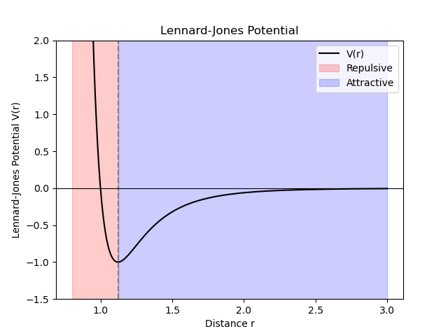
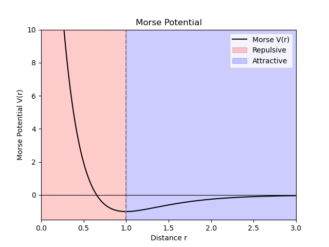

# 1. Introduction

## Characteristic length and times scales for molecular dynamics

|           Types           |    Time scale     | Time scale (s)          |
| :-----------------------: | :---------------: | ----------------------- |
|      Bond vibration       | 1 fs; Femtosecond | $10^{-15}$ s            |
|   Collective vibration    | 1 ps; Picosecond  | $10^{-12}$ s            |
| Conformational transition |   ps or longer    | $>10^{-12}$             |
|     Enzyme catalysis      |   $\mu$s to ms    | $10^{-6}\sim 10^{-3}$ s |
|      Ligand binding       |   $\mu$s to ms    | $10^{-6}\sim 10^{-3}$   |
|      Protein folding      |      ms to s      | $10^{-3}\sim 10^0$ s    |

For an atomistic simulation, it typically use an iteration time step of 1 fs (to capture bond vibrations)

And the accessible time scale for us with atomistic simulation MD is $100\text{ns} = 10^5 \text{ ps}=10^8 \text{ fs}=10^{-7} \text{s }$ 
$$
N_\text{steps}=\frac{T_\text{total}}{t_\text{step}}
$$
e.g. for an  materials with 1000 atoms, to simulate the 100 ns of real-world motion, we need to calculate the forces on every single atom and update their positions $10^8$ times.

## Empirical potential energy

### Lennard Jones potential

$$
\begin{aligned}
V(r)&= \frac{B}{r^{12}}-\frac{A}{r^6}\\
V(r)&=4\epsilon[(\frac{\sigma}{r})^{12}-(\frac{\sigma}{r})^6]
\end{aligned}
$$

- $\sigma$ is the unit of length scale
- $\epsilon$ is the unit of energy scale

### Morse potential

$$
\begin{aligned}
V(r) &= D[1-e^{(-\alpha \cdot (r - r_0))}]^2 - D \\
&= D[\exp(-2\alpha \cdot (r - r_0)) - 2\exp(-\alpha \cdot (r - r_0))]
\end{aligned}
$$

- D is the unit energy scale, also often refers to bond dissociation energy
- $\alpha$ is the elastic properties, or force constant (the spring constant) of the bond
- $r_0$ is the equilibrium distance.

### Buckingham potential

$$
V(r)=Ae^{-\frac{x-x_0}{\rho}}-\frac{C}{(x-x_0)^6}\\
=A\exp[-\frac{r}{\rho}]-\frac{C}{r^6}-\frac{D}{r^8}
$$

$\frac{D}{r^8}$: sometimes a $2^{nd}$ order term is added to satisfy van der Waals perturbation theory ($r^{-8}$)

**Fundamental issues of pair potentials**

> [!NOTE]
>
> - Pair potentials can not "count bonds", and do not care about the organization of atoms (angles, etc.)
> - In pair potential models the cohesive energy on an atom is largely determined by how many bonding partners are around the atom

