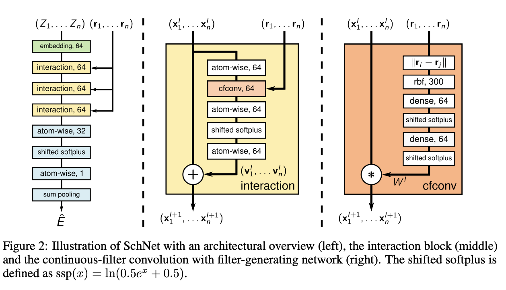

# SchNet

## Background

1. CNN is dealing with grids such as image, videos. While atom (cartesian coordinates) are continuous. Such discretizing space loses precise geometric information.

2. Previous model only predict energy, forces derived from those models are not conserved (anti-physical)

   

## Introduction

All of the computation is applied to stable systems which means equilibrium conditions. i.e., local minima of the potential energy

surface $E(r_1,...,r_n)$ where $r_i$ is the position of atom $i$

But it's not clear how obtain an equilibrium state without optimize the position of atoms. Therefore, we need to compute both the total energy $E(r_1,...,r_n)$ and the forces acting on the atoms.
$$
F_i(r_1,...,r_n)=-\frac{\partial E_i}{\partial r_i}
$$
**Requirement for a MLFF**

1. In order to learn the equilibrium state, the model should  learn a representation for molecules using equilibrium and non-equilibrium conformations.
2. Invariance of the molecular energy with respect to rotation, translation and atom indexing.

### Continuous-filter convolutions

Given the feature representations of $n$ objects $X^l = (x^l_1,...,x^l_n)$ with $x^l_i\in\mathbb{R}^F$ at locations $R=(r_1,...,r_n)$ with $r_i \in \mathbb{R}^D$ , the continuous-filter convolutional layer $l$ requires a filter-generating function

Let us first compare the difference of conventional CNN and their "continuous-filter convolution":

- Conventional CNN: $(x*w)(t)= \int x(a)w(t-a)da$ 
- Continuous-filter convolution: $(x^l*w^l) = \sum x_j^I\circ w^l(r_i-r_j)$, $\circ$ is the element wise production.

Instead of just relying on the initial randomized  weight of the filter which is implemented in common CNN (such Radom weight behaves like different grid scan strategies.) The SchNet method use atomic coordinates to get the weight of convolution $W^l : \mathbb{R}^D\rightarrow \mathbb{R}^F$, which maps from a position to the corresponding filter values.

Where: $x_i^l \in \mathbb{R}^F$ is the feature representation of n objects at locations $R=(r_1,...,r_n)$ with $r_i\in\mathbb{R}^D$

### Architecture

**Molecular representation **

A molecule in a certain conformation can be described uniquely by a set of n atoms with nuclear charges $Z = (Z_1,...,Z_n)$ and atomic positions $R= (r_1,...r_n)$.

With the atomic number Z, we can use embedding to get the feature $X^0$ at the first layer. $a_{Z_i}$ is initially randomized type embeddings.
$$
X^0 = a_{Z_i}
$$
**Atom-wise layers** 

Dense layers, which is responsible for recombination of features
$$
x_i^{l+1} = w^lx_i^l+b^l
$$
**Interaction **

This interaction block is responsible for updating the information of geometric information $R=(r_1,...,r_n)$ and the feature maps
$$
x_i^{l+1}=x_i^l + v_i^l
$$
**Filter-generating networks **

In order to satisfy the requirements for modeling molecular energies, they restrict their filters for the cfconv layers to be rotationally invariant. The rotational invariance is obtained by using interatomic distances as input for the filter network.
$$
d_{ij}=\lVert r_i-r_j\rVert
$$

> [!NOTE]
>
> Note there is a trick there, my understanding is that:
>
> Since according to the harmonic characteristics of the bond. Energy has global minimum at a critical value $d_0$, e.g. attract force at $d>d_0$, repulsive at $d<d_0$. By this since, just imagine that $d_{ij}$ will be quite small because many d will be quite similar. Also, another effect by initialization of weight of dense layer will be quite small. Thus, $wd+b$ is close to 0 at initial training stage. The following activation function will treat it as linear. That's when the problem comes out. For $d \pm \nabla d$, it optimize to be linear (larger/smaller weight with respect to longer distance.) But the real situation should be concave. This leads to a plateau at the beginning of training that is hard to overcome.

The they avoid this by expanding the distance with radial basis functions:
$$
e_k(r_i-r_j) = \exp{(\gamma\lVert d_{ij}-\mu_k}\rVert^2)
$$
Due to this **additional non-linearity**, the initial filters are less correlated leading to a faster training procedure. Choosing fewer centers corresponds to reducing the resolution of the filter, while restricting the range of the centers corresponds to the filter size in a usual convolutional layer. 

## Training with energies and forces

Recall their goal. One is predict the energy, another is preserve the force conservation.
$$
\hat{F_i}(Z_1,...,Z_n,r_1,...,r_n)=-\frac{\partial E}{\partial r_i}(Z_1,...,Z_n, r_1,..., r_n)
$$
And loss function is (their task becomes multi-task learning):
$$
\mathcal{L}(\hat{E}, (F_1,...,F_n)) = \rho\lVert\hat{E}-E\rVert^2+\frac{1}{n}\sum^n_{i=0}\lVert F_i-(-\frac{\partial \hat{E}}{\partial r_i})\rVert^2
$$
