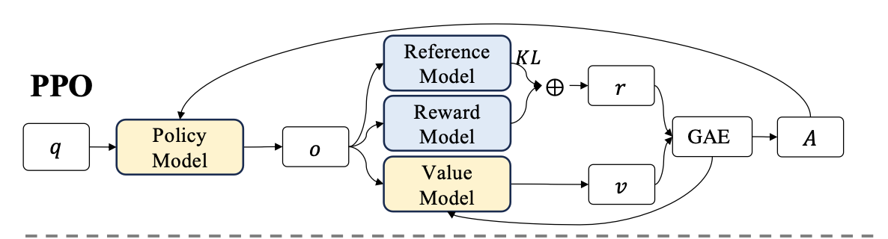
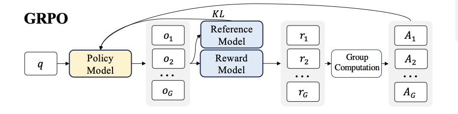

# Reinforcement Learning

## 1. Proximal Policy Optimization (PPO)

Proximal Policy Optimization (PPO)  is an actor-critic RL algorithm that is widely used in the RL fine-tuning stage of LLMs. In particular, it optimizes LLMs by maximizing the following surrogate objective:
$$
\mathcal{L}_\text{PPO}(\theta) = \mathbb{E}[q\sim P(Q),o\sim \pi_{\theta_\text{old}}(O|Q)]\frac{1}{o}\sum_{t=1}^o \min\Big[\frac{\pi_\theta(o_t|q,o<t)}{\pi_{\theta_\text{old}}(o_t|q,o<t)}A_t, \text{clip}\Big(\frac{\pi_\theta(o_t|q,o<t)}{\pi_{\theta_\text{old}}(o_t|q,o<t)},1-\varepsilon,1+\varepsilon\Big)A_t\Big]
$$

- $\theta$ is the parameter (weights) of the current policy model
- $\pi_\theta$ and $\pi_{\theta_\text{old}}$ are the current and old policy models, also refers to the prob of generating token $o_t$ given the context $q$, under the current/old policy.
- $r_\theta=\frac{\pi_\theta(o_t|q)}{\pi_{\theta_\text{old}}(o_t|q)}$ is the probability ratio of the action under the current policy versus the old policy.
- $A_t$ is the advantage estimate at time $t$, which is GAE
- $\varepsilon$ is a small hyperparameter (e.g., 0.2) defining the clipping range. It prevents the rt(θ) ratio from moving too far from 1.0, ensuring safe, stable updates.
- $\text{clip}(x,\min,\max)$, if $x<\min$, it output $\min$; if $x>\max$, it output $\max$; Otherwise $x$.

To calculate the advantage, we apply **Generalized Advantage Estimation (GAE)** on the rewards $r_t$ and a learned value function $V_\omega$

Because we have this per-token reward $r_t$, the Temporal Difference (TD) error calculation for the Critic at every step $t$ :
$$
\delta_t = r_t+ \gamma V_\omega(q_{t+1})-V_\omega(q_t)\\
A_t = \sum_{l=0}^{T-t-1}(\gamma\lambda)^l\delta_{t+1}=\delta_t+\gamma\lambda A_{t+1}
$$

- $\delta_t$: The TD error at step $t$, calculated after the full trajectory is generated.
- $r_t$ is the step by step reward at $t$ step
- $\gamma$ is the discount factor (usually around 0.99)
- $\lambda$: The GAE smoothing parameter (between 0 and 1). This is the magic dial that controls the bias-variance tradeoff.
- $l$: A counter index representing how many steps into the future we are looking.

And the $r_t$ is calculated by the reward function penalize the reward with KL compared with reference model at per-token level, since we don't want to our model deviate too much from the pre-trained model in order to avoid the model crash for getting higher reward:
$$
\left\{
\begin{aligned}
r_t &= -\beta\log \frac{\pi_\theta(o_t|q,o<t)}{\pi_{\theta_\text{ref}}(o_t|q,o<t)} &&\qquad ,t<T\\
r_t &=r_\phi(q,o_t)-\beta\log \frac{\pi_\theta(o_t|q,o<t)}{\pi_{\theta_\text{ref}}(o_t|q,o<t)}&&\qquad, t=T
\end{aligned}
\right.
$$

- $r_\phi$ is the reward model
- $\pi_\text{ref}$ is the reference model, which is usually the initial SFT model
- $\beta$ is the coefficient of the KL penalty

## 2. Group Relative Policy Optimization (GRPO)

Since the value function is employed in PPO to mitigate over-optimization of the reward model, that model should has comparable size as policy model, which brings a substantial memory and computation burden. Additionally, during RL training, the value function is treated as a baseline in the calculation of the advantage for variance reduction.While in the LLM context, usually only the last token is assigned a reward score by the reward model, which may complicate the training of a value function that is accurate at each token.

Group Relative Policy Optimization (GRPO), which obviates the need for additional value function approximation as in PPO, and instead uses the average reward of multiple sampled outputs,
$$
\mathcal{L}_\text{GRPO}=\mathbb{E}[q\sim P(Q), \{o_i\}_{i=1}^G\sim \pi_\text{old}(o|q)]\\
\frac{1}{G}\sum_{i=1}^G\frac{1}{o_i}\sum_{t=1}^{o_i}\Big\{\min\Big[\frac{{\pi_\theta}(o_{i,t}|q,o_{i,<t})}{{\pi_\theta}_\text{old}(o_{i,t}|q,o_{i,<t})}\hat{A}_{i,t},\text{clip}(\frac{{\pi_\theta}(o_{i,t}|q,o_{i,<t})}{{\pi_\theta}_\text{old}(o_{i,t}|q,o_{i,<t})},1-\varepsilon,1+\varepsilon) \hat{A}_{i,t} \Big] -\beta\mathcal{D}_{KL}[\pi_\theta||\pi_{ref}]\Big\}
$$

- $\alpha,\beta$ are hyper-parameters.
- $\hat{A}_{ij}$ is the advantage calculated based on relative rewards of the outputs inside each group only.

